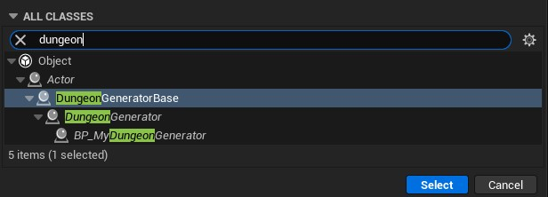
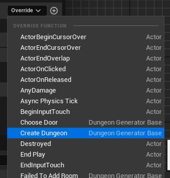
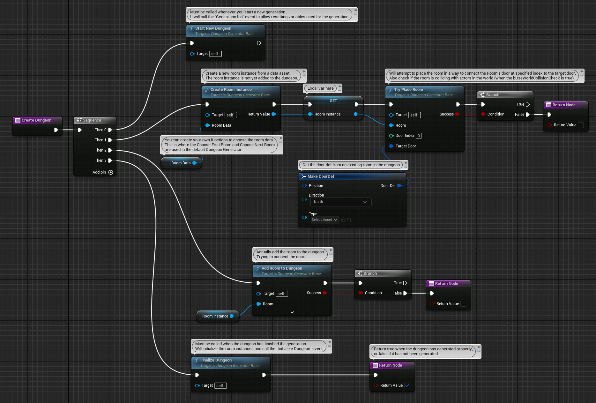

# Custom `Create Dungeon` Function

<!-- BEGIN IMPORTS -->

import Tabs from '@theme/Tabs';
import TabItem from '@theme/TabItem';

import Flowchart from "../Images/Flowchart_Dark.svg";

<!-- END IMPORTS -->

## Introduction

The provided `Dungeon Generator` class in the plugin has a basic default generation algorithm.\
Its behavior is to create a first room and then add new rooms to existing doors.

See the `Create Dungeon` function in the diagram below:

<Flowchart/>

If you are not satisfied with this default behavior, you can write your own `Create Dungeon` function while keeping the core features of the generator.

## The `Dungeon Generator Base` class

To write your own custom `Create Dungeon`, you'll need to create a new class deriving from **`Dungeon Generator Base`**.\
This class has the core features of a dungeon generator: the state machine to load/unload the level instances (shown in the diagram above), the network replication, the room culling system, etc.

<!-- [BEGIN TABS] Blueprint | C++ --> <Tabs groupId="lang" queryString>
<!-- [BEGIN TAB ITEM] Blueprint --> <TabItem value="bp" label="Blueprint" default>

You have to create a new blueprint class deriving from `Dungeon Generator Base`.



Then, the `Create Dungeon` function become overridable.



There are several functions to use inside the `Create Dungeon`.  
See the screenshot below for a list of them, and how to use them.  

:::warning[caution]

This is a **non-working** example!  
Just to show you the most important functions and their use.

:::



<!-- [END TAB ITEM] Blueprint --> </TabItem>
<!-- [BEGIN TAB ITEM] C++ --> <TabItem value="cpp" label="C++">

:::note

You *can* derive from the `Dungeon Generator` class and override the `Create Dungeon` function, but I would strongly discourage that as it will embed some generator's settings and overridable functions that you will certainly not using anymore.

:::

:::tip

You can look into the `Dungeon Generator` class as an example to help you writing your own `Create Function`.

:::

Below is a template to start your class.
You can then add any variables and functions you need for your generation.

```cpp title="MyCustomDungeonGenerator.h"
UCLASS()
class AMyCustomDungeonGenerator : public ADungeonGeneratorBase
{
    GENERATED_BODY()

protected:
	//~ Begin ADungeonGeneratorBase Interface
	virtual bool CreateDungeon_Implementation() override;
	//~ End ADungeonGeneratorBase Interface
}
```

```cpp title="MyCustomDungeonGenerator.cpp"
URoomData* AMyCustomDungeonGenerator::CreateDungeon_Implementation()
{
    // Must be called whenever you start a new generation.
    // It will call the `Generation Init` event to allow resetting variables used for the generation.
    StartNewDungeon();

    // ... Do your generation logic here ...
    // Here the important functions to create and place a new room in the dungeon:
    {
        // Create a new room instance from a room data
        URoom* NewRoom = CreateRoomInstance(RoomData);

        // Will attempt to place the room in a way to connect the NewRoom's door at specified index to the target door.
        // The GetWorld() is used to also check is the room is colliding with actors in the world (when the bUseWorldCollisionCheck is true).
        if (!TryPlaceRoom(NewRoom, NewRoomDoorIndex, TargetDoor, GetWorld())
        {
            // The room could not be placed.
			DiscardRoomInstance(NewRoom);
        }

        // Will actually adds the room into the dungeon and connects the provided doors if possible.
        // This function will call `OnRoomAdded` and return true if the room has been successfully added to the dungeon.
        // You can pass an empty array as `DoorsToConnect` to try connecting all the doors.
        if (!AddRoomToDungeon(NewRoom, /*DoorsToConnect = */TArray<int>{NewRoomDoorIndex}, /*bFailIfNotConnected = */true))
        {
            // The room was not added to the dungeon, because it was invalid (nullptr) or not connected.
            OnFailedToAddRoom(ParentRoomData, TargetDoor);
        }
    }
    // ...

    // Must be called when the dungeon has finished the generation.
    // Will initialize the room instances and call the `Initialize Dungeon` event.
    FinalizeDungeon();

    // You should return true when the dungeon is generated properly.
    // If returning false, the dungeon will be erased and an error will be displayed.
    return true;
}
```

<!-- [END TAB ITEM] C++ --> </TabItem>
<!-- [END TABS] Blueprint | C++ --> </Tabs>

Here the list of functions provided by the `Dungeon Generator Base` class:

- **`Start New Dungeon`**: Call this at the beginning of a dungeon creation. It will reset the rooms and call `Generation Init`.
- **`Finalize Dungeon`**: Call this at the end of dungeon creation. It will initialize all room instances and call `Initialize Dungeon`.
- **`Create Room Instance`**: Use this function to create a new room instance based on a room data. You will be able to move it afterward and try to place it in the dungeon.
- **`Discard Room Instance`**: Use this function to explicitly discard a room instance from the dungeon creation. The room must not be placed in the dungeon as this instance will be pooled and may be reused afterward when calling `Create Room Instance`.
- **`Try Place Room`**: Call this to move the room instance, using one of its door to target an existing door location. This function will return whether the room instance overlaps another existing room in the dungeon or optionally colliding with the world (outside of the dungeon). **The room is not added to the dungeon yet!**
- **`Try Place Room At Transform`**: Same as `Try Place Room` but you provide directly the room transform instead of letting the plugin compute the room transform from a target door location.
- **`Add Room To Dungeon`**: Use this to finally add the room instance to the dungeon. It will try to connect its door indices you provide (or all doors if you don't provide them). It will call `On Room Added` if the room is actually added to the dungeon. You may call `On Failed To Add Room` if the room is not added to the dungeon.
- **`Yield Generation`**: See below section for its use.

## Splitting the workload on multiple frames

If your `Create Dungeon` function does a heavy workload that causes CPU spikes, you can split the workload on multiple frames.

To do so, you can use the node [`Yield Generation`](api/Classes/DungeonGeneratorBase/Nodes/YieldGeneration/YieldGeneration.md) which will tell the generator to call the `Create Dungeon` function once again in the next frame.

That way, you can for example group the room placements in small batches each frame!

:::note

Make sure to add some flags in your algorithm to avoid calling `Start New Dungeon` or `Finalize Dungeon` each time.

:::
