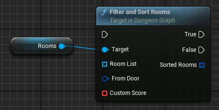
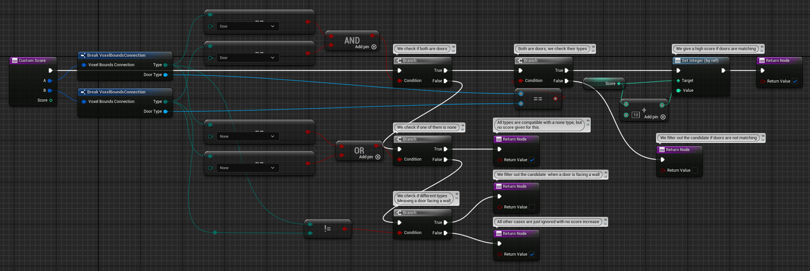
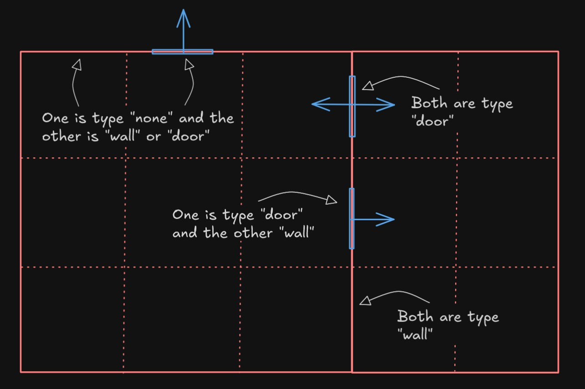

# Filter and Sort Rooms

The plugin v3.6 introduces a new node, and an extremely useful one.

## Explanation

As its name implies, its purpose is to **filter** and **sort** a list of room data.

Each element in the output array is an union of a room data and one of its door. This is called a `Room Candidate`.  
Thus, one room data in the input array may appear several times in the output array, if multiple doors of the room allows it to be placed.

A room is filtered out (not included in the output) if it can't be placed in the dungeon (e.g. no compatible door, or overlapping with existing rooms).

If a room candidate can be placed, a score is computed.  
By default, the room size and the door alignments are used to compute this score, but you can create a custom function to compute this score (see next section).

The output array is sorted using this score, so the highest score is the first element of the array.

## Custom Score Function

Here is a simple example for a custom score function.

This is called for each side of each cell of the room candidate.

You return `True` if the room candidate is still valid, or `False` if you want to discard the room candidate from the output array.

You can add, subtract or set the value of the `Score` input depending on the cases.

There is currently 3 types of cell side:

- `None`: the cell is not occupied by a room.
- `Wall`: the cell is occupied by a room but no door is defined on this side.
- `Door`: the cell is occupied by a room, and a door is defined on this side.

In the case of a `Door` side type, the `Door Type` field is set to the [`Door Type`](Door-Types.md) asset (or none if using the default door type).

See this drawing below to better understand the different cases you can encounter:

