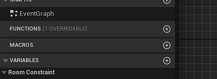

# Room Constraints

Room constraints are useful if you want to add some constraints to the placement of your rooms.

You set up your constraints in your `Room Data` assets, and then you can use some nodes to check those constraints during your dungeon generation process.

The node `Does Pass All Constraints` will tell you if a specific `Room Data` asset is passing all its constraints in a specific case.

The [`Filter and Sort Rooms`](./Filter-Sort.md) node does already check the constraints internally to filter out the rooms. So no need to do it yourself too.

There are some built-in constraints in the plugin, but you can create your own constraints too.

## Built-in Constraints

### Location Constraint

Using bound limits you define, this constraint will prevent the room to be placed outside of the limits.  
The limit must take into account the size of the room, as the constraint will not allow the room to cross outside the limits.

### Direction Constraint

Allows the room to be placed only facing specific directions.  
You can specify multiple valid directions for the room.

### Count Limit Constraint

This constraint allows the room to be placed unless there are already a maximum number of this room in the dungeon.

## Creating Custom Constraints

To create your own room constraints, first create a child class of `Room Constraint`, then override the `Check` function.

You must return true if you want to allow the room to be placed, or false to prevent the room to be placed.

