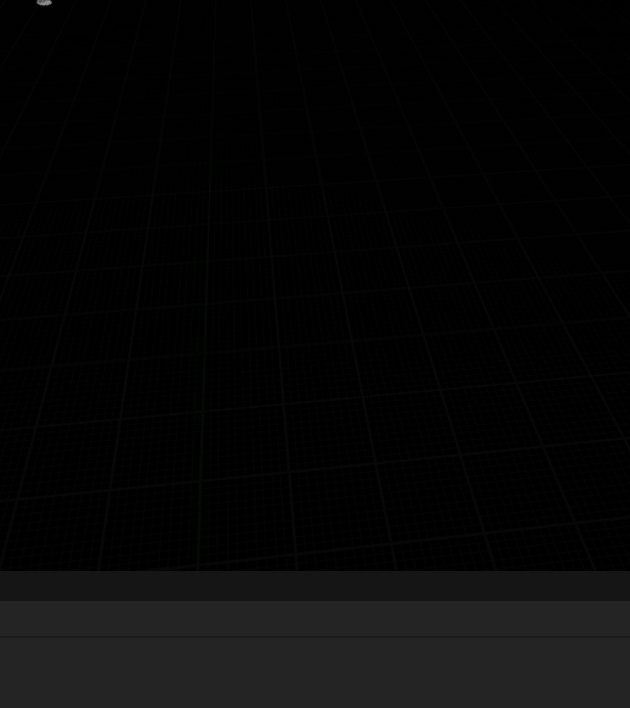
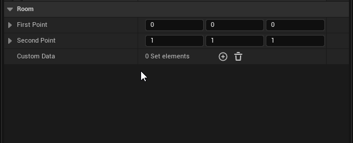
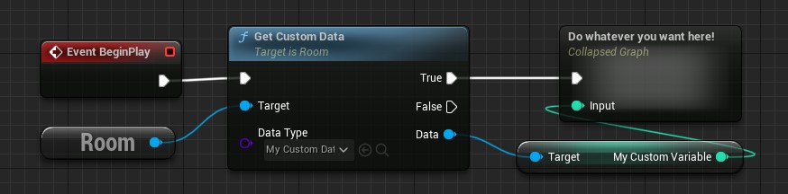

# Room Custom Data

You can add variables as much as you want in your `RoomData` assets. However they are only static variables shared by all room instances spawned with the same `RoomData`.

Custom data are here to let you add variables and behaviors independents for each of the generated room instances. You **can *not*** set the value of their variables in room data assets, but you can initialize them during the [Room Initialization](Room-Initialization.md) phase of the dungeon.

## Example usage

Custom data can be useful if you want for example initialize some chest loot in only one room for a boss key.

To achieve that example, you can create a `BossKeyCustomData` class where you define a boolean `HasBossKey`.\
This boolean tells whether the room instance should put a boss key in one of its chests.

Then, in the overridden `Initialize Dungeon` of the dungeon generator, you get all room instances with this custom data and select one of them randomly.\
You then access this room's `BossKeyCustomData` and set its `HasBossKey` to true.

Finally, in the Level Blueprints of rooms with `BossKeyCustomData`, you check if this boolean is true.\
And if so you get one if its spawned chest actor to add the boss key in it.

This example can be done another ways too.
For example we could instead do something cleaner if we use an inventory system.\
We could then have a `ChestCustomData` containing a list of item to put in the room chests.\
Then we could just add a boss key item inside that will be used during the level's begin play to put it inside one of the chest actors of the room.

## Create and using Custom Data

To create a custom data, right-click in your content browser and select `Blueprint Class`, then expand the `All Classes` and type in "Custom Data", then select `RoomCustomData` to create a new child blueprint.

You can do whatever you want in it like any other blueprint classes.\
You can then assign them in the `Custom Data` array of the `RoomData` assets you want.

As said above, you can't set variables of the custom data directly from the data asset.\
However, you can get a reference of the instantiated custom data from anywhere you have a access to a room instance, with the `Get Custom Data` function of the room instance.
For example you can access from the `Room` getter in the room level blueprint.

