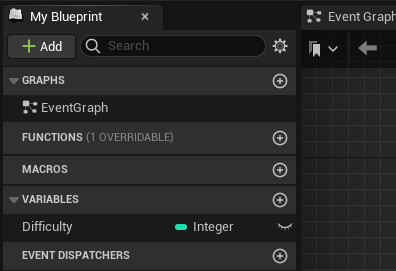
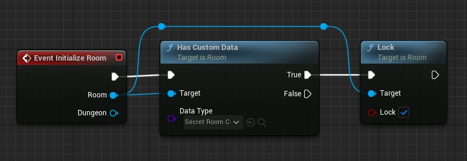
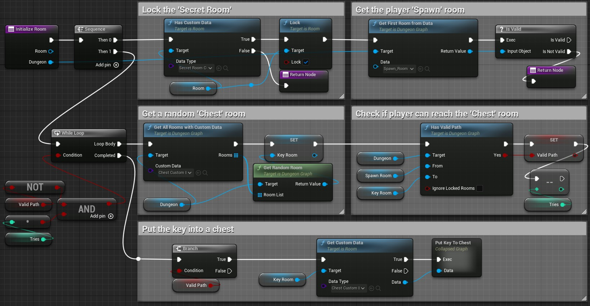
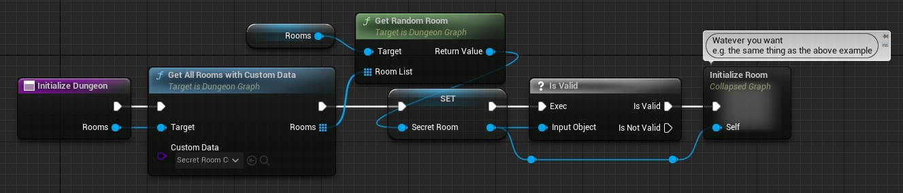

# Room Initialization

Before validating a dungeon, you can do some initialization to the room instances generated by the dungeon.

Room instances are **NOT** room levels, so you do not have access to actors inside the levels.\
If you want to initialize actors, you have to put your code in the `BeginPlay` of your blueprint levels where you can access their room instance to initialize the actors.

Room instances do not have many thing to initialize by default, but you can extend their instance specific data by using [Room Custom Data](Room-Custom-Data.md).

## Inside the Room Data

The first place where you can initialize instances values is inside your `RoomData` **child blueprints**.
You can override the function `Initialize Room` which is called just after the last [Continue To Add Room](../Getting-Started/Generating-Dungeon/Continue-To-Add-Room.md) (the one returning false) and before [Is Valid Dungeon](../Getting-Started/Generating-Dungeon/Is-Valid-Dungeon.md).

Inside it we can access the room instance's functions (e.g. `Lock`) and its custom data.\
For the examples, in the following pictures I will use a `Secret Room` and a `Chest` custom data but they are not provided by the plugin.

A simple example is to lock the room if it has a `Secret Room` custom data.

A little more complex example is to also put a key in another room (e.g. a room with a chest) so the player will be able to unlock the secret room.

## Inside the Dungeon Generator

The second place where you can initialize room instances is the `Initialize Dungeon` function of the [Dungeon Generator](../Getting-Started/Generating-Dungeon/Dungeon-Generator.md).

You can do the same thing here than in the `Initialize Room` above. You'll just have to get the room you want first.\
The example below shows a way to initialize just one `Secret Room` in the dungeon:

