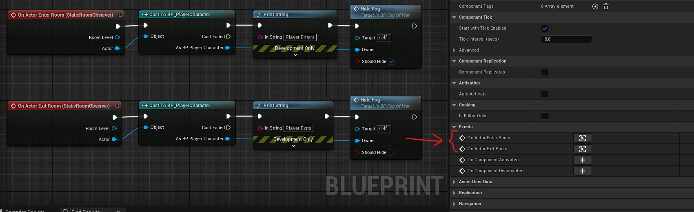

# Room Observer

The room observer components allows actors to be notified whenever any actor enters or exits a room.\
The components bind themselves to the `Room Level`'s `On Actor Enter Room` and `On Actor Exit Room` delegates and then call their own `On Actor Enter Room` and `On Actor Exit Room` delegates.\
Thus, once placed on an actor, you just have to bind to the component delegates to be notified when those events occur.\
*Only actors that don't ignore the [`Room Object Type`](../Getting-Started/Plugin-Settings.md) collision channel will trigger the events.*

## Room Observer Component

Place this component on your actors if they **can move between rooms** *or* **are not placed in room levels**.

This component implements the [Room Visitor](Room-Visitor.md) interface to detect whenever the actor enters/exits room to bind automatically to the delegates.
So, the actor with this component needs to be setup to overlap with the [`Room Object Type`](../Getting-Started/Plugin-Settings.md) collision channel.

## Static Room Observer Component

Use this one if your actors **will never get out of their room** *and* **are placed in room levels**.

This component will bind to its parent level at `Begin Play` and unbind at `End Play` automatically.
It has much less overhead than the non-static `Room Observer` component.
Thus, it makes a good choice when you have lot of actors that need this feature and are static to their room.

## How to use it

Just add the component on any actor, and then bind to its delegate the way you want.

Here a simple example of a "fog of war" actor that will hide/show itself when the player enters/exits its room.
It is an actor placed directly in the room level and will never move to another room, so I attached a `Static Room Observer` on it.

