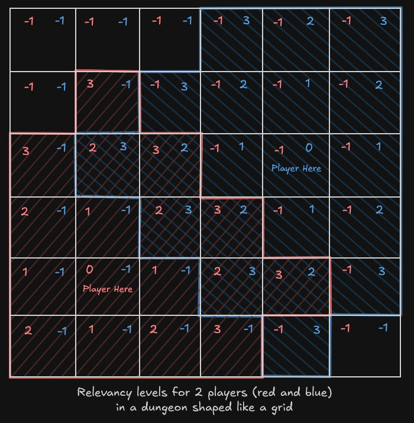

# Room Relevancy

In some cases, for gameplay purpose or any other purpose, you may want to have access to how far a room is from a player.

The room relevancy is here to help you with that!

You can set up how far the relevancy is computed (the farthest, the more time it will compute). So it is better to limit the relevancy distance to what you need, using the field `Room Relevance Max Distance` in the `Dungeon Generator` class.

Here an example of the relevancy computed for 2 players. The max distance is set to 4, so a room is relevant up to a distance of 3 to the player (0 is the first iteration of the distance, the room where the player is).

You can use some nodes to get access to this relevancy level of a room.

- [Get All Relevancy Levels](api/Classes/Room/Nodes/GetAllRelevancyLevels/GetAllRelevancyLevels.md)
- [Get Min Relevancy Level](api/Classes/Room/Nodes/GetMinRelevancyLevel/GetMinRelevancyLevel.md)
- [Get Max Relevancy Level](api/Classes/Room/Nodes/GetMaxRelevancyLevel/GetMaxRelevancyLevel.md)
- [Get Relevancy Level](api/Classes/Room/Nodes/GetRelevancyLevel/GetRelevancyLevel.md)

A positive or zero value is the distance to the player. A negative value means the room is not relevant to the player.

There is also an event dispatcher `On Relevancy Changed` available in the room to be notified whenever the relevancy changes for any player.  
Here an example usage of the event in a custom actor:

