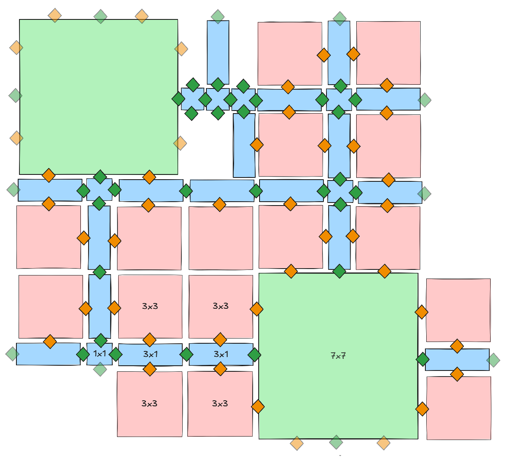
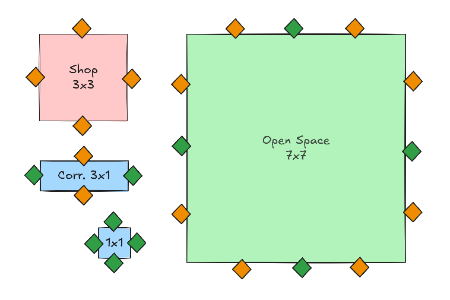

# Creating Dungeon Generation Algorithm

If you struggle creating the dungeons you want, this page will help you getting a good basic workflow to design and code the dungeon you want to generate.

:::note

To illustrate the workflow, I'll use a simple example: a mall-like dungeon.\
This is only to help you understand the process behind creating your code based on a desired result.\
You can do anything else you want, you just have to follow the same steps.

:::

## 1. Defining what we want

The first step is to write down the features of our dungeon and the end result we want to have.

I want to make a mall-like dungeon.
A mall is basically composed of 3 types of rooms:

- Shops
- Corridors (to navigate from one shop to another)
- Large open spaces (contain stairs and escalators to navigate through floors)

To keep my example simple, I don't want to have a start and end room. The player will spawn at any shop and the goal is to kill a creature using items found throughout the mall.\
This allows me to also demonstrate you are not constrained to a type of dungeon layout.

Here a drawing of a part of the layout we would want to generate (I've colored the rooms depending on their types: blue for corridor, red for shop, green for open space):



:::note

I have drawn only one floor of the dungeon to keep the drawing simple, but the open spaces are meant to have doors on multiple floors, so the generated dungeon will have multiple floors like a real mall.

:::

:::tip

I tried to standardize the room sizes to fill the most space possible and create loops easily.\
I used the width of a corridor as a room unit to have simpler room size values and to make it scalable easily depending on the camera view chosen when designing the [3Cs](3Cs.md).

:::

## 2. Deducing the pieces of the puzzle

Once we've defined the result we want to achieve, we will list all the pieces we need to assemble this puzzle.

After drawing the layout I want, I noticed I will need 2 types of doors:

- Doors connecting corridors to shops (in orange). They are automatic sliding doors.
- Doors connecting corridors between them or with open spaces (in green). They have no meshes at all so this will create a feeling of continuity.

Also, I've used only 4 rooms to get a good looking result:



:::note

Those rooms are just the room definitions (size and doors), but several rooms can be created for each of them (for example different kind of shops), breaking the feeling of repetitiveness for players while keeping the dungeon layout simple.

:::

## 3. Deducing the constraints

Once we have our small pieces and the ideal layout we want to achieve, we can deduce the "constraints" (or "rules") of room placement.

In the case of my example, I noticed those constraints:

- 2 open spaces can't be directly connected.
- 2 shops can't be connected directly.
- There are less corridors 1x1 than corridors 3x1 (about 20% 1x1 and 80% 3x1)
- Corridors 1x1 are not directly connected to other corridors 1x1
- Open spaces are less likely to to appear than any other corridor (about 10% open space and 90% corridors)

## 4. Writing pseudo-code

Once the constraints have been deduced, we can write quickly a pseudo-code based on those constraints to see how we can determine the next room based on the current room.

I'll use the terms `currentRoom` for the room already generated, and `door` for the door on which the next room will be connected to the `currentRoom`.\
I didn't created a "start" and an "end", so I decide to use an open space as first generated room, and stop adding corridors after a number of room is reached (called `minRoomCount` in my pseudo-code).

```txt title="Pseudo-code of ChooseNextRoom function"
if (door.type == shopDoor) and (currentRoom.type != shop) then
    return random shop from a list of shop room
else if (door.type == corridorDoor) and (rooms.count < minRoomCount) then
    randomNumber := get random number
    if (randomNumber < 10%) then 
        return random open space from a list of open space
    else
        randomNumber := get random number
        if (random number < 20%)
            return corridor 1x1
        else
            return corridor 3x1
        endif
    endif
else
    no room placed
endif
```

:::note

This pseudo-code is a first draft and will need to be iterated on to get the best result. For example the percentage values can be tweaked, the conditions can be modified, new constraints can be added, etc.

:::

Here I'll break down how I've written it:

```txt
if (door.type == shopDoor) and (currentRoom.type != shop) then
    return random shop from a list of shop room
```

I've placed first the most specific case: when we encounter a shop door, we want to place a shop *only* if the current room is not a shop.

```txt
else if (door.type == corridorDoor) and (rooms.count < minRoomCount) then
```

We want to continue to place corridors at corridor doors until we reach the minimum number of room in the dungeon.

```txt
    randomNumber := get random number
    if (randomNumber < 10%) then 
        return random open space from a list of open space
```

We store the random number in a variable, so that this number will not change for each check we do on it.\
Then if this number is below the "open space" threshold, we place an open space room.

```txt
    else
        randomNumber := get random number
        if (random number < 20%)
            return corridor 1x1
        else
            return corridor 3x1
        endif
    endif
```

Here I made an independent random number check because I've deduced a 80-20 ratio of corridors 3x1 and 1x1, but I could've scaled those values down to 90% total to use the same random number as the one used for the open space threshold.

```txt
else
    no room placed
endif
```

Finally, if another case than the previous one is encountered, we don't place a room (for example, the dungeon generator may want to place a room from a shop, and in that case we don't want to).

## Conclusion

I didn't coded directly the code in blueprint to generate the dungeon.
Instead I wrote on paper the desired result and going through several steps to deduce the code from it.

The summary of the steps:

- Defining what are the components (room types) of our dungeon and drawing the desired result.
- Deducing all the basic pieces (kind of rooms and type of doors).
- Deducing the "constraints" (or "rules") between those pieces.
- Writing pseudo-code from those constraints.
