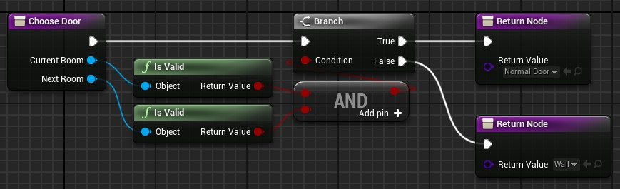

# Choose Door

This function let you choose a [door actor](Door.md) to spawn between 2 rooms.\
If you don't want a door between the rooms you just have to return `none`.

You should use the `Door Type` input to return a door of the correct type if you use multiple door types in your project.\
You can check the door type of a door actor class with the function `Is Door Of Type`.

You can use the `Flipped` output to control which room the door faces.\
If false (default) the door forward will face the `Current Room`.\
If true, the door forward will face the `Next Room`.

One of the room class input can be null if there is no room connected to it.
You certainly want to set an always closed door, or a door actor that act as a "wall".

An example to spawn a simple door if both rooms are valid, or a wall if one of them is not valid (assuming there is only one door type):

