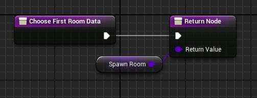

# Choose First Room

<!-- BEGIN IMPORTS -->

import Tabs from '@theme/Tabs';
import TabItem from '@theme/TabItem';

<!-- END IMPORTS -->

This function defines the root of the dungeon generation, *not* the first room where the player starts.\
You **must** pass a valid `RoomData`, or the generator will throw an error.

:::tip

You can use whatever room that makes sense in your project.\
For example, my [dungeon example project](https://github.com/BenPyton/DungeonExample) uses the spawn room of the player as first room.\
However, if for example you want multiple spawn rooms for different player teams, you can use another room, like an end/boss room as first room to generate.

:::

Here an example where we always set the same room as the first room dungeon:

<!-- [BEGIN TABS] Blueprint | C++ --> <Tabs>
<!-- [BEGIN TAB ITEM] Blueprint --> <TabItem value="bp" label="Blueprint" default>



<!-- [END TAB ITEM] Blueprint --> </TabItem>
<!-- [BEGIN TAB ITEM] C++ --> <TabItem value="cpp" label="C++">

```cpp title="MyDungeonGenerator.h"
UCLASS()
class AMyDungeonGenerator : public ADungeonGenerator
{
    GENERATED_BODY()
public:
    // ...

    virtual URoomData* ChooseFirstRoomData_Implementation() override;

    // This variable is just for example purpose
    UPROPERTY(EditAnywhere, BlueprintReadWrite, Category = "My Dungeon")
    URoomData* FirstRoom {nullptr};

    // ...
}
```

```cpp title="MyDungeonGenerator.cpp"

URoomData* AMyDungeonGenerator::ChooseFirstRoomData_Implementation()
{
    return FirstRoom;
}

```

<!-- [END TAB ITEM] C++ --> </TabItem>
<!-- [END TABS] Blueprint | C++ --> </Tabs>
