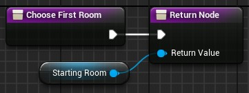

# Choose First Room
This function define the root of the dungeon generation.

In output, you have to pass a non-null RoomData.

Here an example where we set always the same room as the first room dungeon:\

### **Next Step**
The next step after the first room choice is [the choice of the other rooms](Choose-Next-Room-Data.md).
