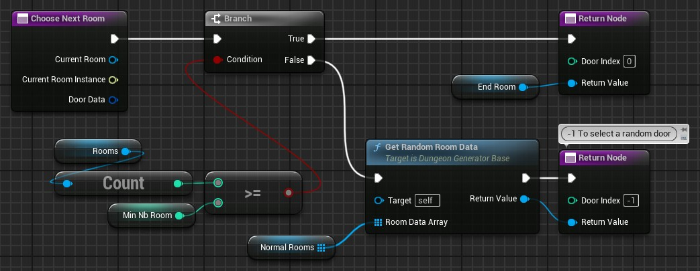

# Choose Next Room

This function is the main part of the procedural generation: it's where you set your own logic to generate your dungeon.\
This function is run each time the generator tries to add a room to the dungeon.

As input parameters:

- `Current Room` is the room from which the generator will try to add the next room.\
For example, the first time this function is called, the `Current Room` is the `RoomData` asset you have returned in the [`Choose First Room`](Choose-First-Room-Data.md) function.
- `Door Data` is the door on which the next room will be connected to.\
You have access to its location (expressed in room units, not in unreal units!), its orientation and its `DoorType`.

As output:

- `Return Value` is the `Room Data` asset you want to add as the next room. The value must be non-null and have at least one compatible door with `Door Data`.
- `Door Index` is the index of the door (from the `Room Data` asset your return) used to connect with the `Current Room`.\
If the index is negative, it will choose a random compatible door.\
If you set a value, it will take the door at the same index in your `Room Data` asset (*make sure the door is compatible!*)

Here an example of a simple dungeon made by `NbRoom` randomly chosen standard rooms before setting an exit room:

:::warning[How can I do it?]

If you struggle to write the code in this function, I would suggest you to read [this page](Best-Practices/Workflows/Dungeon-Generation-Algorithm.md) to better understand the workflow to write the code in this function.

:::
