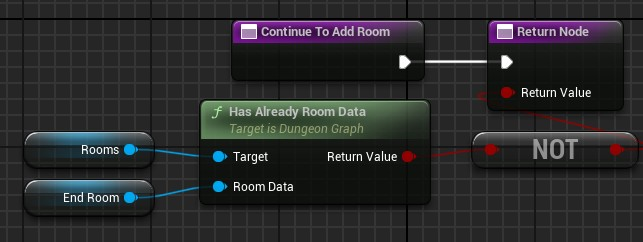

# Continue To Add Room

This function determine if the generation should continue or not.

A generation will naturally stops if there are no unconnected door left.\
But in most cases this is not happening and you have to stop the generation before it spawns too many rooms.\
So you have to return false in this function to stop the generation.

In output, you have to return true to continue the generation, or false to stop it.

Here an example where we let the generation ends naturally (**be careful of infinite loop**):\

### **Next Step**
The next step after stopping the generation is [to validate the generation](Is-Valid-Dungeon.md).
