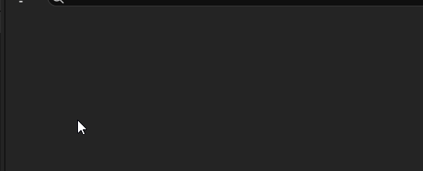

# Door Types

By default, the room data's doors are set with no door type.\
In that case, they'll use the default door size from the [plugin settings](Plugin-Settings.md).

However, you can create door type assets to diversify your doors in the dungeon. Door types act like some tag system. A room can connect to another room's door only if it has the same door type.\
You can check a room compatibility with a door before-hand with the `Get Compatible Room Data` function of the [dungeon generator](Dungeon-Generator.md). This function will return all room data with at least one door of the same type as the provided door.

Creating a door type is as simple as 2 clicks: right-click on your content browser and select `Procedural Dungeon` -> `Door Type`.

The door type asset has some variables in it, but none of them are used during the dungeon generation.

**`Size`**\
Size of the rendered door bounds by the debug drawing. This is just a visual hint for artists and designers so they can see at a glance the volume taken by the door.\
(the level designer will not put anything inside it, and the artist will try to fill the space with the door mesh).\
To see the correct door size in the `Door` actor blueprint viewport, you have to set the `Type` variable of the `Door` actor.

**`Description`**\
This is just some description only visible in the asset. Not used anywhere else.
