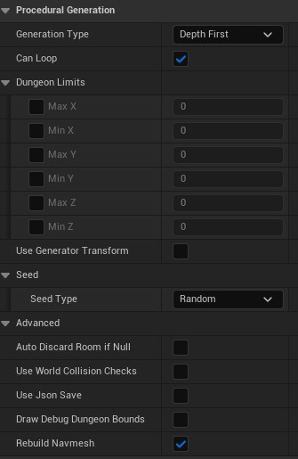

## Create a dungeon generator

The dungeon generator is an actor placed in your main level. It is responsible to generate the dungeon and spawn the room levels.\
To create one, create a new blueprint, expand "All Classes" and type `DungeonGenerator`.

The dungeon generator don't work directly by itself, you have to [[create data and levels for your rooms|Getting Started]] first.

To be able to generate a dungeon, you also have to override some minimal functions:
- [[Choose First Room Data]]
- [[Choose Next Room Data]]
- [[Continue To Add Room]]
- [[Is Valid Dungeon]]
- [[Choose Door]]

There are some other functions you can override:
Function | Description
--- | ---
**Pre&#160;Generation** | Called before anything else when the generator is about to generate a new dungeon.
**Post&#160;Generation** | Called after loading and initializing all rooms of the dungeon. Use it to spawn or teleport players in the first room.
**Generation&#160;Init** | Called each time the generation start over when `Is Valid Dungeon` returns false. Mostly used to reset all your custom generation variables.
**Generation&#160;Failed** | Called when `Is Valid Dungeon` returned false after too many generation attempts. No dungeon is generated when this is called.
**On&#160;Room&#160;Added** | Called when a room is successfully added to the dungeon (but not spawned yet). The added room is destroyed when `Is Valid Dungeon` returns false (you may have to use *GenerationInit* to reset variables changed from this call).
**Initialize&#160;Dungeon** | Called after `Continue To Add Room` returned false. Allows you to initialize room instances before validating the dungeon with `Is Valid Dungeon` (useful if you want for example locking some rooms and putting keys in other ones).

## Useful functions of the Dungeon Generator

Aside the internal events you can override, there are some useful other functions the `Dungeon Generator` provides to you.\
There are also the `Generate` and the `Unload` functions.

Take a look at the [API Documentation](https://benpyton.github.io/ProceduralDungeon/api/Classes/DungeonGenerator#nodes) for a list of all functions provided by the `Dungeon Generator`.

## The `Rooms` variable, at the heart of the plugin

The `Rooms` variable of the `Dungeon Generator` contains the list of all generated room instances.\
You can search for specific room instances, count them, check a path exists between rooms, etc.
Take a loook at the [API Documentation](https://benpyton.github.io/ProceduralDungeon/api/Classes/DungeonGraph#nodes) for a list of all functions provided by the `Rooms` variable.
## Generator settings
The `Dungeon Generator` actor has some parameters grouped inside the `Procedural Generation` category:

#### Use Generator Transform
If checked, the dungeon will be offset and rotated using the dungeon generator actor's transform.\
If unchecked, the first room will be placed at world's (0,0,0) and no rotation will be applied.

#### Generation Type
- The `depth first` will prioritize the last added room to continue the generation. 
This will result in a dungeon more linear with shorter dead ends.
- The `breadth first` will prioritize the first added room to continue the generation. This will result in a more spread dungeon.

This is an example using the same very basic generation rules defined in this wiki. We just set a counter of 20 rooms to add the end room. So with depth first we have a lot of rooms to reach the end but dead-ends of only 1 room each. And with the breadth first, we have less rooms until the end, but the dead-ends are the same length of the path to reach the end (some dead-ends are shorter because the algorithm can't place a room after).\

#### Can Loop
If checked, when a new room is placed in the dungeon, any door aligned with another door of other rooms will be connected.\
If unchecked, only the door from the previous room (the one used to generate this room) will be connected.\
*This parameter is only used when `Can Loop` from the project-wide [[settings|Plugin Settings]] is also checked.*

#### Seed Type
- `Random`: at each generation, the seed is randomly chosen.
- `Auto Increment`: the initial seed is used the first time, then a fixed number will be added at each generation. This will produce different dungeon at each generation, but you will have the same generation sequence each time you play.
- `Fixed`: the initial seed is used each time you generate, so you will always get the same dungeon.

#### Seed
The initial seed you want to use if the `Seed Type` is not `Random`

#### Seed Increment
The number used to increment the seed if the `Seed Type` is `Auto Increment`

#### Use World Collision Checks
When checked, the dungeon generator will test a box overlapping with world static actors in order to allow or not a room to be generated.\
This can be CPU-intensive and should be used only when necessary. Though, it is only used during the generation process, not during gameplay.
