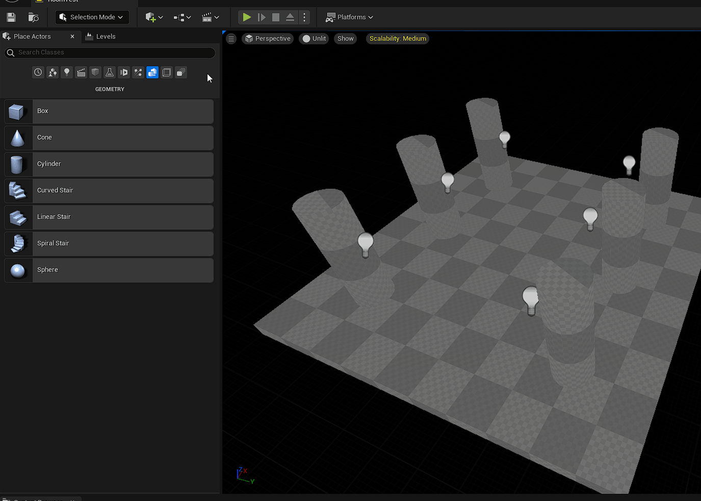

# Geometry Brushes

:::warning[Limitations]

You can use geometry brushes to design your levels, but be aware that geometry brushes will **break** some features of the plugins.

:::

The first thing you should know is that geometry brushes can't have their visibility toggled, and thus they could not be hidden by the [room culling](Occlusion-Culling.md) system of the plugin.

The second thing is, for an obscure reason to me, the navmesh will not be generated correctly when the dungeon is generated, and so the AI agents will not work properly in your dungeon.

So, as long as you are just designing you rooms, you can use geometry brushes.\
However, if you want to use those rooms in your generated dungeon, you should convert them in static meshes first (see the gif below) in order to have all the functionalities of the plugin to work properly.

