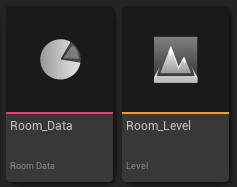
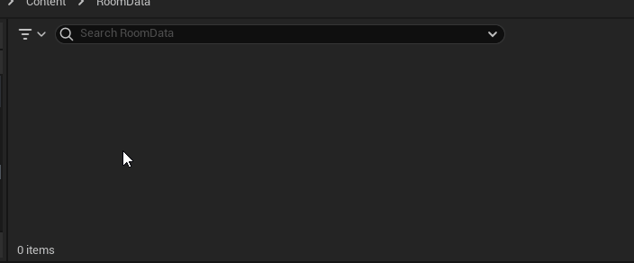
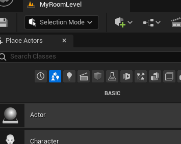
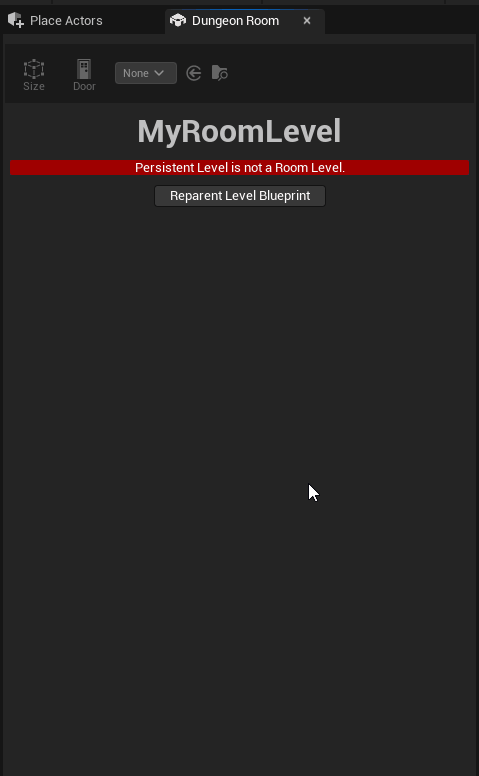
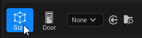
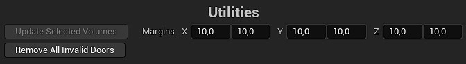

${\color{orange}\boxed{WARNING}}$ This page is for plugin version 3.X.X and higher. If you use a version 2.X.X, please read the page [[Room Architecture]] instead.

# Room Architecture

**Each** room is composed by 2 assets : the level and the data.\

The level is a classic Unreal Engine level in which you design your room as you like.\
The data is an asset of type `RoomData` that defines the room properties (size, doors, etc.).\
You can inherit from `RoomData` class in C++ or in Blueprint to add properties specific for your game.

But remember, you **must** create one level per room data (you can't use the same room level for multiple room data).

Before anything else, you should set the [[plugin's settings|Plugin Settings]] to your desire:
- Rooms are defined with a bounding box, so the plugin will not generate overlapping rooms.\
The bounding box size is expressed in terms of Room Unit. The default is 1000x1000x400 unreal units.\
You should define it first.
- Doors have also a size to display with a debug box, so artists and designers can see at a glance the volume doors will occupy. There can be several [[types of door|Door Types]] with different sizes, but the default one is set in the [[plugin's settings|Plugin Settings]].\
However, the door size doesn't affect anything during the dungeon generation.

# How to create a room

### Step 0 - Creating a RoomData blueprint class (optional)

If you want specific data in your rooms, you can create a new child blueprint of from `RoomData`.\
*(You can do this step only once for all your room data, or you can skip it if you don't need specific data for your rooms)*\

To create a new `RoomData` **class**, right-click in content browser and select `Blueprint Class`.\
Then expand the `All Classes` and type "RoomData" in the search bar. You can then select it.\

After doing so, you can add your own data inside this blueprint class (for example an integer representing the difficulty of the room). You can also make multiple `RoomData` blueprint classes, but I will don't tell you how Unreal works here ;)

### Step 1 - Creating a RoomData asset (one per room)

The first required thing to do is to create a `RoomData` asset.\
It is done simply by right-clicking in your content browser, then choosing `Procedural Dungeon` -> `Room Data`.\
If you have created child blueprints of room data, you can pick the one you want here.

I don't recommend editing the data directly by opening it from the content browser.\
You will be able to do it in a later step below. 

### Step 2 - Creating and editing a Room Level (one per room)

Now you have to create a new Unreal level by right-clicking in your content browser and select `Level`.

Open your newly created level, then select the `Dungeon Room` editor mode.

If your level is not already reparented to the `RoomLevel` script blueprint (most likely the case), the editor mode will propose you to reparent it with a button.\
Click on it, and now you should have a `Data` field where you have to choose your newly created `RoomData` asset above.

The details of the asset will show up below the level's `Data` field.\
To complete the mandatory settings, you have to set the data's `Level` field to your current level (if not the case an error message is displayed).

Now you can design your room as you want, and update the `RoomData` accordingly with the help of the tools described below.

# Editor Tools

When in `Dungeon Room` editor mode, you have access to 2 tools to ease your room data manipulation.

The `Size` tool will allows you to edit the room's bounding box by dragging points in the viewport.

The `Door` tool will allows you to add or remove doors easily by clicking on your room bounding box in the viewport (left-click to add, right-click to remove).\
If you want to place different [[door types|Door Types]], you can select the one you want in the selector beside the tool button.\
If none is selected, then the default door is used.

# Utility Functions

When in `Dungeon Room` editor mode, you also have access to some utilities to ease your room creation.

### Update Selected Volumes
In most cases, you'll end up with some volumes in your room levels that should be of the same size as the room.\
For example, you could have a NavMesh Bounds Volume and a Post Process Volume. Making them the size of the room bounds might be tedious when doing it for many room levels.\
This button will help you doing it automatically for all the selected volumes. You can also specify some margins to add on each side of the room with the `Margins` field beside the button.\
(you can specify the default margins in the [[plugin's editor settings|Plugin Settings]])

### Remove All Invalid Doors
When you resize the room bounds while some doors have already been placed, they can become invalid (turning orange) because they are inside or outside the room bounds.\
You can't delete them from the viewport, and instead you would have to find them in the data asset and delete them here. This might be tedious to do as you don't have an easy way to know which door is which.\
This button will help you by removing automatically all invalid doors of the room data asset.

# Next Step

After you created some rooms, you have to create a [[dungeon generator actor and configure it|Dungeon Generator]] with your own generation rules.
