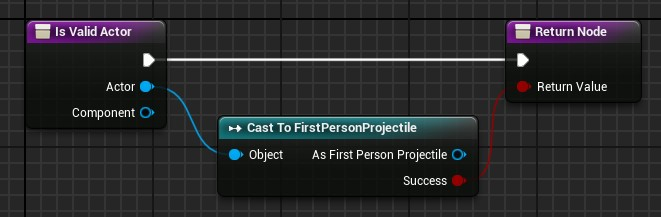
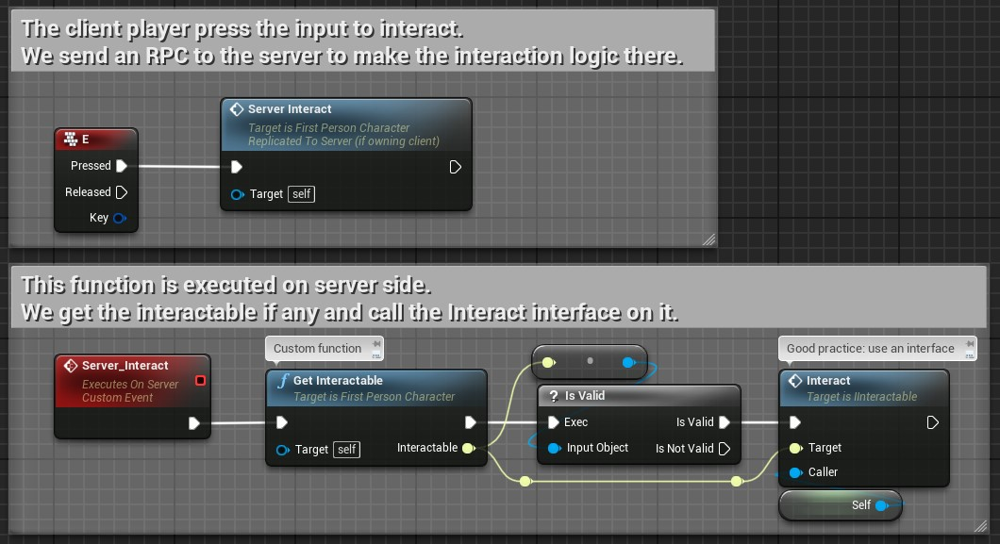

# Door

The `Door` class is the base class for all doors spawned by the dungeon.

You have to manage yourself how your doors open or close.\
For that, you just need to create a child blueprint class of `Door` and call the `Open`  function whenever you want to open or close the door.\
You then can do what you want when a door opens or closes by overriding the events `OnOpen` and `OnClose` (like playing animation, sounds, effects, etc.).

If you want to place walls instead of doors when the rooms are not connected, you still need to inherits your blueprint from the `Door` class, but with no logic inside and just a wall static mesh.

You can lock or unlock a door to prevent players from opening the door if you want. You just need to call the `Lock` function for that.

If you want to see the correct size depending on the [door type](Door-Types.md) in the blueprint viewport of the actor, you have to set the `Type` variable of the door.

### Trigger Doors

The `TriggerDoor` class is a `Door` which will open or close depending of actors being inside its trigger box.

By default, all `Character` actors trigger the door, but you can change this behavior by overriding the `IsValidActor` function.

### Multiplayer

The open/close state of the doors are replicated over the network.\
However, you'll need to do your game network logic correctly to make doors work properly in multiplayer.

For example, if you want to make a door that open/close on a player key press, you'll need to send an RPC from your `PlayerController` or your controlled `Pawn` in order to call your interaction function on you door to open/close it.\
*(The screen below uses a generic interface to interact with any interactable actor. See the "Good Practice" section below on how to do it)*

---

### Good Practice

The screen above uses a custom interface called `IInteractable` to generalized the player interaction with whatever actor you want in the game.

**This section is not specific to the `Door` class of this plugin**, but I will explain briefly how to use an interface in Unreal blueprint for those who are not familiar with this concept.

First, you have to create the interface class and populate it with some functions. For the example, I called it `IInteractable` (the first `I` is a naming convention for interfaces) and I put two functions inside it:

- `CanInteract` which takes an `Actor` (named `Caller`) in input if I need to check some things before interacting, and returns a `bool` (true if `Caller`is able to interact).
- `Interact` which takes also the `Caller` actor as input, and do the actual interaction on the `IInteractable` actor.

Remember that you can create *any* function with *any* inputs and outputs you want in the interface.

Then you have to add the new interface in your interactable actor settings (the door in my example).

<!-- put an image here -->

Then, you implement the `CanInteract` and the `Interact` functions from the interface in your actor.
