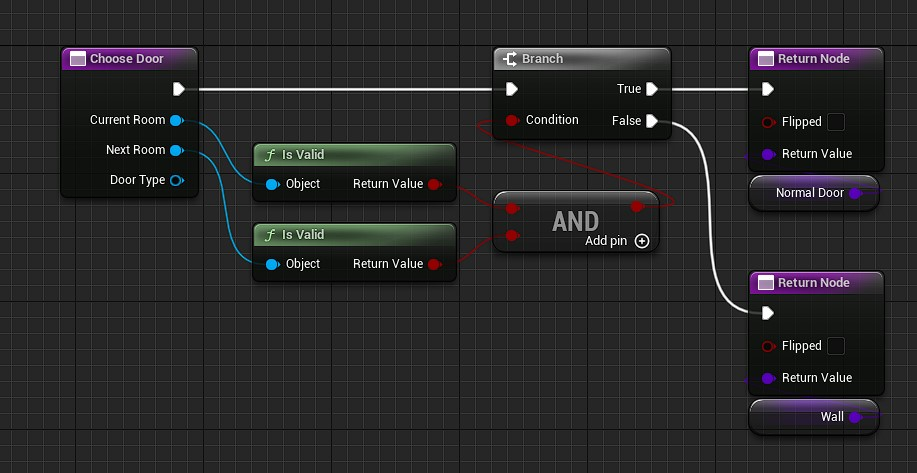

# Choose Door

<!-- BEGIN IMPORTS -->

import Tabs from '@theme/Tabs';
import TabItem from '@theme/TabItem';

<!-- END IMPORTS -->

This function lets you choose a [door actor](../Door.md) to spawn between two rooms.\
If you don't want a door between the rooms you just have to return `none`.

You should use the [`Door Type`](../../Advanced-Features/Door-Types.md) input to return a door of the correct type if you use multiple door types in your project.\
You can check the door type of a door actor class with the function `Is Door Of Type`.

You can use the `Flipped` output to control which room the door faces.\
If false (default) the door forward will face the `Current Room`.\
If true, the door forward will face the `Next Room`.

One of the room input can be null if there is no room connected to it.
You certainly want to set an always closed door, or a door actor that act as a "wall".

An example to spawn a simple door if both rooms are valid, or a wall if one of them is not valid (assuming there is only one door type):

<!-- [BEGIN TABS] Blueprint | C++ --> <Tabs groupId="lang" queryString>
<!-- [BEGIN TAB ITEM] Blueprint --> <TabItem value="bp" label="Blueprint" default>



<!-- [END TAB ITEM] Blueprint --> </TabItem>
<!-- [BEGIN TAB ITEM] C++ --> <TabItem value="cpp" label="C++">

```cpp title="MyDungeonGenerator.h"
UCLASS()
class AMyDungeonGenerator : public ADungeonGenerator
{
    GENERATED_BODY()
public:
    // ...

    virtual TSubclassOf<ADoor> ChooseDoor_Implementation(const URoomData* CurrentRoom, const URoomData* NextRoom, const UDoorType* DoorType, bool& Flipped) override;

    // The following variables are just for example purpose
    UPROPERTY(EditAnywhere, BlueprintReadWrite, Category = "My Dungeon")
    TSubclassOf<ADoor> NormalDoor {nullptr};
    
    UPROPERTY(EditAnywhere, BlueprintReadWrite, Category = "My Dungeon")
    TSubclassOf<ADoor> Wall {nullptr};

    // ...
}
```

```cpp title="MyDungeonGenerator.cpp"

TSubclassOf<ADoor> AMyDungeonGenerator::ChooseDoor_Implementation(const URoomData* CurrentRoom, const URoomData* NextRoom, const UDoorType* DoorType, bool& Flipped)
{
    const bool bAreBothRoomValid = IsValid(CurrentRoom) && IsValid(NextRoom);
    return (bAreBothRoomValid) ? NormalDoor : Wall;
}

```

<!-- [END TAB ITEM] C++ --> </TabItem>
<!-- [END TABS] Blueprint | C++ --> </Tabs>
