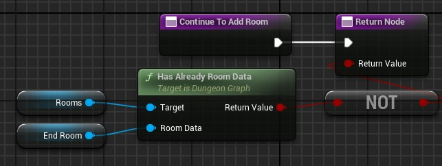

# Continue To Add Room

<!-- BEGIN IMPORTS -->

import Tabs from '@theme/Tabs';
import TabItem from '@theme/TabItem';

<!-- END IMPORTS -->

This function tells the generator to continue or not calling the [`Choose Next Room`](Choose-Next-Room-Data) function.

A generation will naturally stops if there are no remaining unconnected doors in the dungeon.\
But in most cases this is not happening and you have to stop the generation before it spawns too many rooms.\
Returning false in this function will stop the generation.

In output, you have to return true to continue the generation, or false to stop it.

Here an example where we stop the generation as soon as the end room has been placed:

<!-- [BEGIN TABS] Blueprint | C++ --> <Tabs groupId="lang" queryString>
<!-- [BEGIN TAB ITEM] Blueprint --> <TabItem value="bp" label="Blueprint" default>



<!-- [END TAB ITEM] Blueprint --> </TabItem>
<!-- [BEGIN TAB ITEM] C++ --> <TabItem value="cpp" label="C++">

```cpp title="MyDungeonGenerator.h"
UCLASS()
class AMyDungeonGenerator : public ADungeonGenerator
{
    GENERATED_BODY()
public:
    // ...

    virtual bool ContinueToAddRoom_Implementation() override;

    // This variable is just for example purpose
    UPROPERTY(EditAnywhere, BlueprintReadWrite, Category = "My Dungeon")
    URoomData* EndingRoom {nullptr};

    // ...
}
```

```cpp title="MyDungeonGenerator.cpp"

bool AMyDungeonGenerator::ContinueToAddRoom_Implementation()
{
    return !GetRooms()->HasAlreadyRoomData(EndingRoom);
}

```

<!-- [END TAB ITEM] C++ --> </TabItem>
<!-- [END TABS] Blueprint | C++ --> </Tabs>
