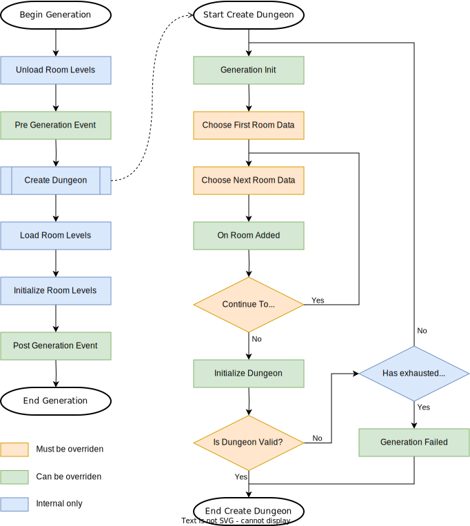

# Procedural Dungeon Plugin

## Overview
This is an Unreal Engine plugin that let you create dungeons procedurally like "The Binding of Isaac" or "Rogue Legacy" but in 3D.\
With this plugin you create rooms by hand and you define your generation rules with blueprint.\
The plugin then generate a dungeon that can be random or deterministic following what rules you've programmed. 

## Example

Some hand-made rooms defined with bounds and doors:\

Some very simple generation rules:
- A special room (red) used to spawn the player.
- Then 10 rooms chosen randomly in a list (blue, green, yellow, cyan).
- Then a special room (purple) used as an end goal for the player.
- Finally 10 other rooms chosen randomly.

Possible results:\

## Lifecycle of a dungeon generation
Before creating your rules, you should understand how the plugin works.\
A generation is made of 4 phases : 
- Unloading the previous dungeon levels (destroying static actors, etc.)
- Generating a virtual dungeon (your rules are defined here)
- Loading the dungeon levels (spawning actors, etc.)
- Initializing the dungeon levels (`BeginPlay` of room's level blueprints)

Here is the flowchart when we call `Generate` on a dungeon generator:

<picture>
  <source media="(prefers-color-scheme: dark)" srcset="Images/Flowchart_Dark.svg">
  
</picture>

## What you need to do
First, read the [[Installation]] page to install the plugin.\
Then, read and follow the instructions in the [[Dungeon-Generator]] page.

You can get the [example project in the release page](https://github.com/BenPyton/ProceduralDungeon/releases/tag/v2.0.1) if you want a minimal working project.

## Tips
The generation take a certain time (the generation itself is done on one frame, but the instantiation and loading of each room take some times proportionally to the number and complexity of the rooms). 
So, if you have the player character spawned at start, it will fall into the void of the universe before the dungeon has the time to generate.

To manage this situation, you have multiple solutions:
- The easy and ugly way is to place a little plane somewhere with the player start on it, and disable the inputs from the player to prevent him to fall from this plane, then when the generation is complete you teleport the player into the first room and unlock the inputs;
- The better and cleaner way is to spawn the player as spectator until the generation is finished, and then you spawn the character actor in the first room (or anywhere else if you want to) and make it possessed by the player controller.

Both solutions use the `Post Generation Event` to know when the generation is done.
You will also want to show or keep a loading screen when you start your game map, and you hide it on this event too.

