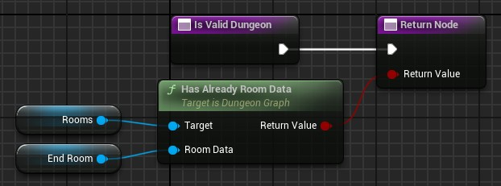

# Is Valid Dungeon

This function determine if the dungeon correspond to your needs.\
Check all you want here and return true if the dungeon meets all your requirments.\
If you return false, the generator erases all and begin a new generation.

In output, you have to return true to validate the dungeon, or false to regenerate.

Here an example where we check if the dungeon has an exit:\

### **Next Step**
The next step validating the generation is to [choose the doors between the rooms](Choose-Door.md).
