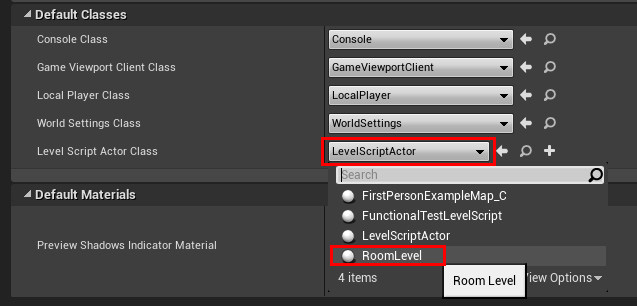

# Room Architecture (plugin v1)

:::warning

This page is for plugin v1.x.x **only**.\
If you use plugin v2.x.x, please read the [Room Architecture (plugin v2)](Room-Architecture) page instead.\
If you use plugin v3.x.x, please read the [Getting Started](Creating-Rooms) page instead.

:::

### Understanding the architecture

Rooms are composed by 2 objects : the level and the data.\
.jpg)

The level is an Unreal level where you create your room.\
The data is an asset of type `RoomData` that define the room properties.\
You can inherit from `RoomData` to add properties specific to your dungeon.

### How to create a room

First, create a new Unreal level.

Then create a new blueprint that inherit from `RoomData`.\
For that, expand the "all classes" and type "RoomData" in the search bar and select it.

After that, open the `RoomData` blueprint and set the level field with your newly created level.

Then open your level, and go to the level blueprint (`Blueprints -> Open Level Blueprint`).

If it's not already done, reparent the blueprint to RoomLevel.\

(In general you want to create a lot of room, so you can go to your `Project Settings -> Engine -> General Settings` and set the `Level Script Actor Class` to `RoomLevel` thus you don't have to reparent each level)\

Then in the data field of this blueprint set your room data you've just created.\
.jpg)

There you have successfully created your room.

### Room Parameters

If you have followed the previous steps to create a room, then you should have something like this:\

This is a unit room with a door oriented to the north.\
All actors and meshes should not cross the red boundary.\
Doors are represented by a blue box.\
The magenta sphere is the room origin (this cannot be changed).

You can set the size of your room (the red box) in its `RoomData` blueprint.\

This size is expressed in room unit, can't be a float value and should not be negative nor zero.\
For example, if your room unit is 10m\*10m\*4m and your real room size is 5m\*23m\*10m, then your room data size should be 1\*3\*3.

You can add as many door as you want in your room, and the entrance will be chosen randomly at generation (if checked).\
But keep in mind that a door has to be on the border of the room boundary, not inside, and the arrow have to point to the outside of the room boundary.\

Door position is expressed in room unit and correspond to the "cell" of the room.

You can change room unit and door size in `Project Settings -> Plugins -> Procedural Dungeon`.\

