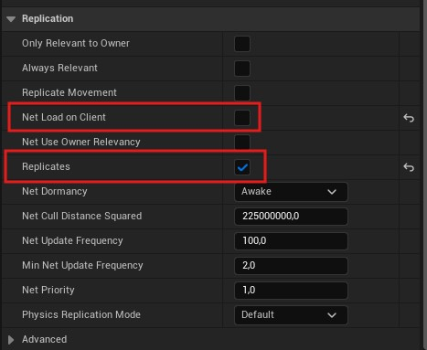
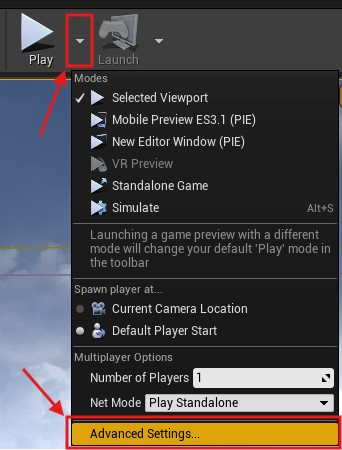
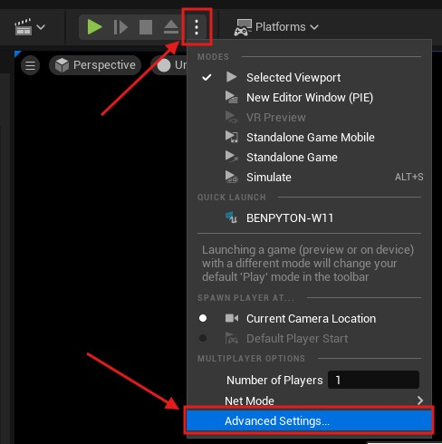
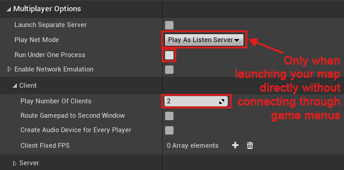
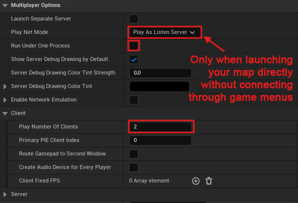
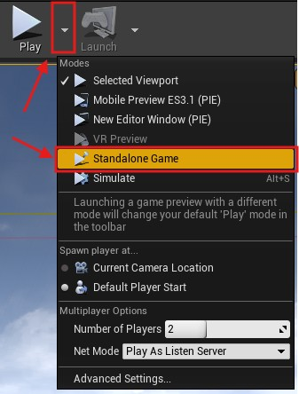
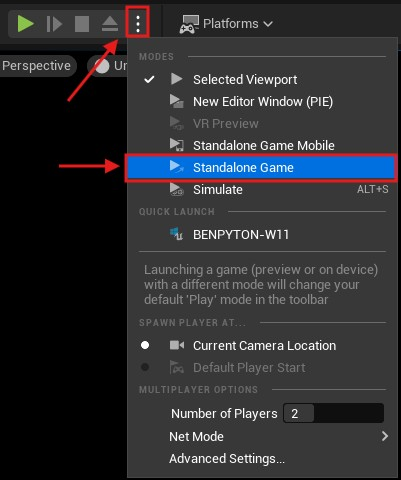

# Multiplayer

<!-- BEGIN IMPORTS -->

import Tabs from '@theme/Tabs';
import TabItem from '@theme/TabItem';

import Flowchart from "../Images/Flowchart_Dark.svg";

<!-- END IMPORTS -->

:::info[Prerequisites]

This guide assumes you have minimum knowledge about multiplayer in Unreal Engine.\
It does not aim to teach you how to create multiplayer games in Unreal.

If you are new to multiplayer in Unreal Engine, I would suggest you to read this [Multiplayer Network Compendium](https://cedric-neukirchen.net/docs/category/multiplayer-network-compendium).

:::

## Overview

The first important thing to know is that only the server will generate the dungeon.\
The clients will replicate the room instance list from the server and then load/unload accordingly the levels.

<Flowchart/>

If you look at the state machine above, both server and client start in a state `idle`.

When the `Generate` function is called on the server, it will trigger a generation process.\
It will run the `CreateDungeon` function after all previous rooms was unloaded.\
When this function is ended, it will replicates the new room list to the client.

When the client receives the replicated room list from the server, it will also triggers a generation process.\
However the client does **not** run the `CreateDungeon` function and loads directly the new rooms.\
Finally it will goes back to the `idle` state like the server.

This system is beneficial because, unlike the previous versions of the plugin, any client joining after the server has generated the dungeon will properly load all rooms.
Also this ensure that all clients have the same rooms as the server.\
However, a lot more data will be sent over the network, especially if you have a huge amount of rooms in your dungeon.

## How to do actor replication with this plugin

- **Doors** are properly replicated over the network.\
However, you still need to do some logic correctly on your project in order to make it work properly.\
See the multiplayer section of the [door wiki page](../Getting-Started/Door.md) for details on it.

- **Actors spawned by yourself** will be replicated as you would do normally.

- **Actors directly placed in room levels** can be replicated like you would do with a normal unreal level.\
However, you should not forget to [replicate](https://cedric-neukirchen.net/docs/multiplayer-compendium/replication) properly your actors.
Also, the `Net Load on Client` must be unchecked to avoid any issue.

<!-- [BEGIN TABS] Blueprint | C++ --> <Tabs>
<!-- [BEGIN TAB ITEM] Blueprint --> <TabItem value="bp" label="Blueprint" default>



<!-- [END TAB ITEM] Blueprint --> </TabItem>
<!-- [BEGIN TAB ITEM] C++ --> <TabItem value="cpp" label="C++">

```cpp
AMyActor::AMyActor()
{
    // ...
    bReplicates = true;
    bNetLoadOnClient = false;
    // ...
}
```

<!-- [END TAB ITEM] C++ --> </TabItem>
<!-- [END TABS] Blueprint | C++ --> </Tabs>

## Multiplayer in Editor

While it could be played in viewport, there may be some issues occurring. So it is advised to test your multiplayer features in standalone game instead.

You have to change some settings in the editor in order to test your game in multiplayer.

Here is how to setup the editor.\
*(Some options may be located elsewhere on newer versions, but they should be all present)*

1. First, you have to click on the arrow next to the play button and go to `Advance Settings`

<!-- [BEGIN TABS] UE4 | UE5 --> <Tabs groupId="ue-version">
<!-- [BEGIN TAB ITEM] UE4 --> <TabItem value="ue4" label="UE4">



<!-- [END TAB ITEM] UE4 --> </TabItem>
<!-- [BEGIN TAB ITEM] UE5 --> <TabItem value="ue5" label="UE5" default>



<!-- [END TAB ITEM] UE5 --> </TabItem>
<!-- [END TABS] UE4 | UE5 --> </Tabs>

2. Then in `Multiplayer Options`, set those options:
    - `Play Number of Clients` to `2` or more
    - Make sure to uncheck the `Run Under One Process` box. This is the most important setting as this will clear almost every issues regarding actors not being replicated.
    - Set the `Play Net Mode` to `Listen Server` *only if you launch your map directly without connection process* (if you want to connect through your own in-game menus, set it as `Play Standalone` instead)

<!-- [BEGIN TABS] UE4 | UE5 --> <Tabs groupId="ue-version">
<!-- [BEGIN TAB ITEM] UE4 --> <TabItem value="ue4" label="UE4">



<!-- [END TAB ITEM] UE4 --> </TabItem>
<!-- [BEGIN TAB ITEM] UE5 --> <TabItem value="ue5" label="UE5">



<!-- [END TAB ITEM] UE5 --> </TabItem>
<!-- [END TABS] UE4 | UE5 --> </Tabs>

3. Finally, close the settings window and click again on the arrow next to the Play button and choose `Standalone Game`

<!-- [BEGIN TABS] UE4 | UE5 --> <Tabs groupId="ue-version">
<!-- [BEGIN TAB ITEM] UE4 --> <TabItem value="ue4" label="UE4">



<!-- [END TAB ITEM] UE4 --> </TabItem>
<!-- [BEGIN TAB ITEM] UE5 --> <TabItem value="ue5" label="UE5">



<!-- [END TAB ITEM] UE5 --> </TabItem>
<!-- [END TABS] UE4 | UE5 --> </Tabs>
