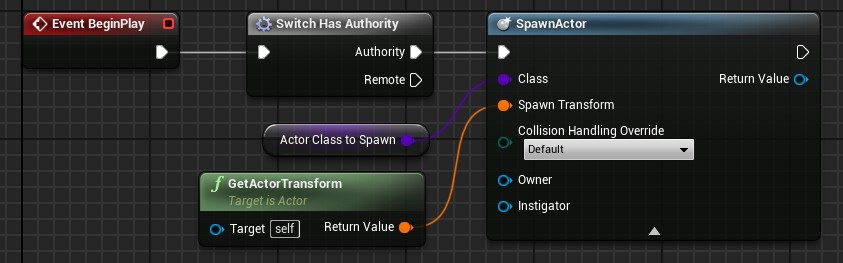
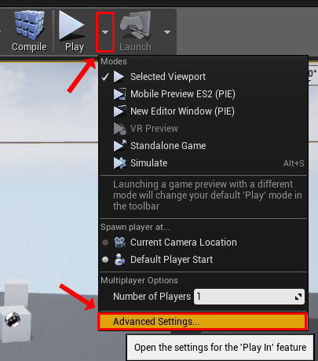
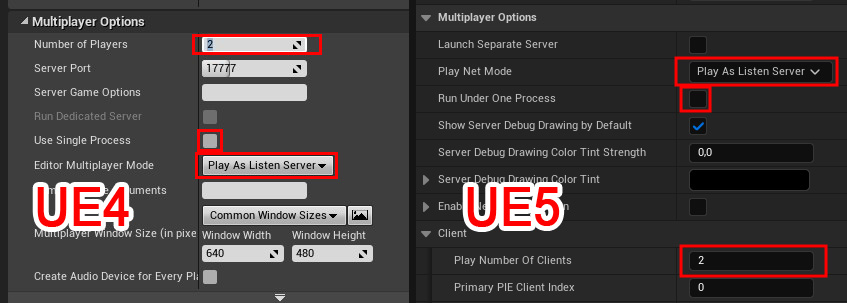
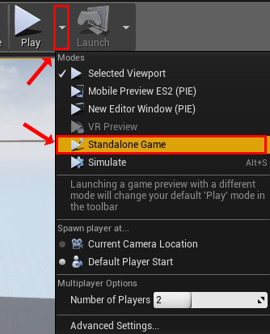

# Multiplayer

:::info[Prerequisites]

This guide assumes you have minimum knowledge about multiplayer in Unreal Engine.\
It does not aim to teach you how to create multiplayer games in Unreal.

If you are new to multiplayer in Unreal Engine, I would suggest you to read this [Multiplayer Network Compendium](https://cedric-neukirchen.net/docs/category/multiplayer-network-compendium).

:::

## Overview

The first important thing to know is that only the server will generate the dungeon.\
The clients will replicate the room instance list from the server and then load/unload accordingly the levels.

If you look at the state machine above, both server and client start in a state `idle`.

When the `Generate` function is called on the server, it will trigger a generation process.\
It will run the `CreateDungeon` function after all previous rooms was unloaded.\
When this function is ended, it will replicates the new room list to the client.

When the client receives the replicated room list from the server, it will also triggers a generation process.\
However the client does **not** run the `CreateDungeon` function and loads directly the new rooms.\
Finally it will goes back to the `idle` state like the server.

This system is beneficial because, unlike the previous versions of the plugin, any client joining after the server has generated the dungeon will properly load all rooms.
Also this ensure that all clients have the same rooms as the server.\
However, a lot more data will be sent over the network, especially if you have a huge amount of rooms in your dungeon.

## How to do actor replication with this plugin

- **Doors** are properly replicated over the network.\
However, you still need to do some logic correctly on your project in order to make it work properly.\
See the multiplayer section of the [door wiki page](../Getting-Started/Door.md) for details on it.

### *Since Plugin v3.0*

- **Actors** directly placed in room levels can be replicated like you would do with a normal unreal level.\
However, you should not forget to [replicate](https://cedric-neukirchen.net/docs/multiplayer-compendium/replication) properly your actors.

### *Before Plugin v3.0*

- **Actors** directly placed in room levels are not replicated. If you want to have some actors (like enemies, chests, NPCs, etc.) and want them replicated, you need to make some workarounds.\
My suggestion:

- In your actor you want replicated, check the `Replicates` field.
- Create and place a spawner actor in your room level. This spawner is not replicated.
- In the `BeginPlay` of the spawner, check if it's server-side (with the `HasAuthority` function) before spawning the real actor you want.
- Spawn the actor if previous point is true. The spawned actor will spawns on all clients too and will be replicated properly.

## Multiplayer in Editor

You cannot play in multiplayer directly from the editor viewport.\
You have to change some settings in the editor in order to test your game in multiplayer.

Here is how to setup the editor.\
*(Some options could be in another place on newer version, but they are all here)*

- First, you have to click on the arrow next to the play button and go to `Advance Settings`.\

- Then in `Multiplayer Options`, set `Number of Players` to 2, uncheck the `Use Single Process` box and set the `Editor Multiplyer Mode` to `Listen Server` or `Client`.\

- Finally, close the settings window and click again on the arrow next to the Play button and choose `Standalone Game`.\

