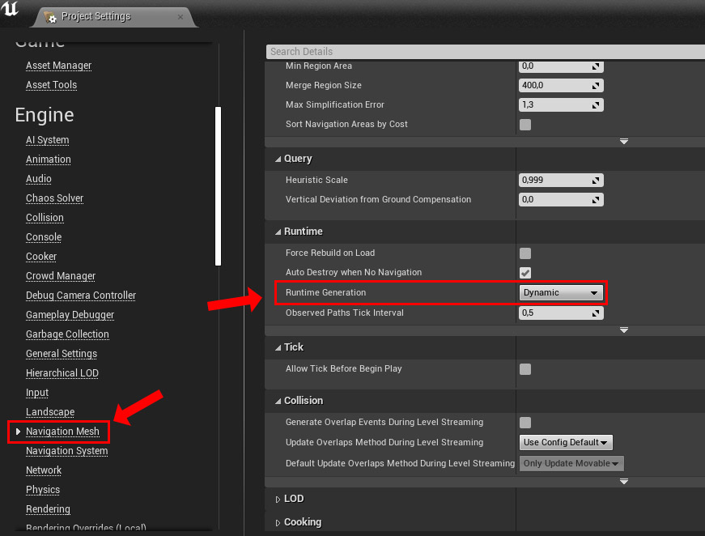

# Navmesh Generation

If you are using the default unreal navigation system ([UNavigationSystemV1](https://docs.unrealengine.com/5.0/en-US/basic-navigation-in-unreal-engine/)), then the navigation mesh is automatically rebuild after each dungeon generation if you setup your project as described below.

If you are not, then you'll have to handle it yourself in the `Post Generation` event of the [dungeon generator](Dungeon-Generator.md) and you can ignore the rest of this page.

## How to configure the default Unreal's navigation system to work with the plugin?

:::danger Limitations

The plugin will work only using a **dynamic** navmesh!\
Currently I don't know how to setup the project in a way to be able to use **static** navmeshes precomputed with each room.\
If you have any clue, please feel free to share it with me on [**Github**](https://github.com/BenPyton/ProceduralDungeon/issues) or [**Discord**](https://discord.gg/YE2dPda2CC).

:::

First, There is a project setting you **must** change if you want the navmesh to be rebuild properly.\
Go to `Project Settings > Engine > Navigation Mesh` and set the `Runtime Generation` to `Dynamic`:

Then, you need to place a `Navmesh Bounds Volume` in your "master" level (the persistent level which contains your `DungeonGenerator` actor).\
Its location and size doesn't matter, it just need to be there.\
Also, make sure that the `RecastNavMesh-Default` automatically added to your level is properly set to `Dynamic`.

After that, you can add a `Navmesh Bounds Volume` in each of your room levels, and design your navmesh with obstacles, and nav link proxies as you would do normally.\
Usually you would make the volume encompassing the whole room bounding box (red box).\
The `RecastNavMesh` settings does not matter in the room levels, since they will be destroyed at the generation and only the one in the persistent level will be used to rebuild the navmesh.

:::warning Be Careful

If you are using some [Geometry Brushes](Geometry-Brushes.md) to create a blockout of your level design, the navmesh will not generate correctly in the persistent level.\
You should convert them into static meshes to properly generate the navmesh.

:::
