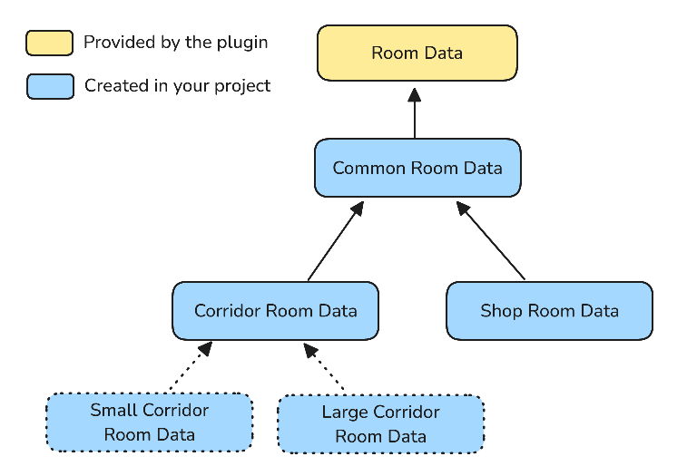
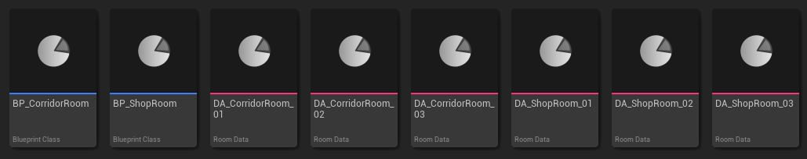
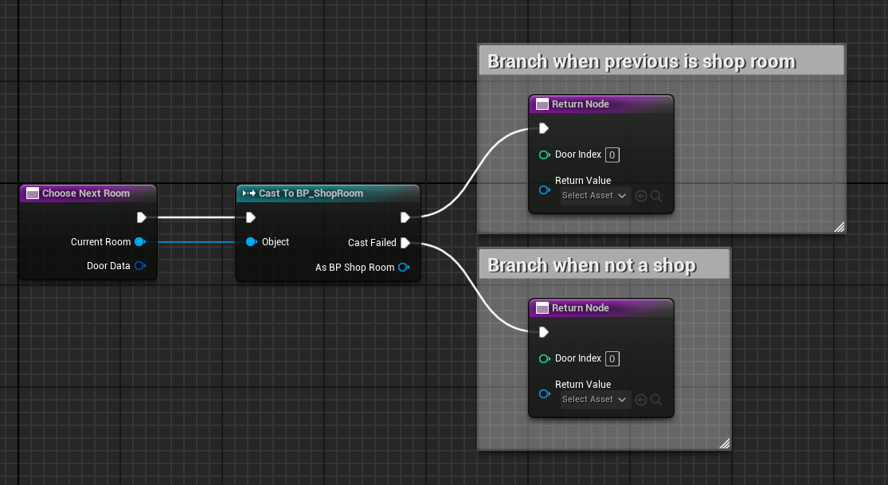
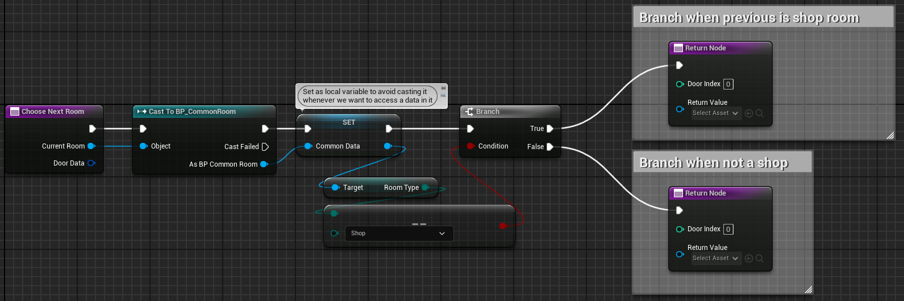
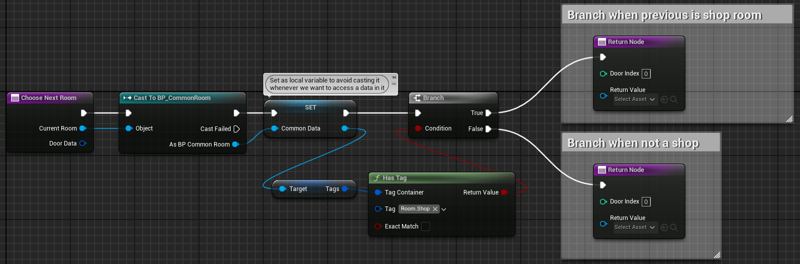
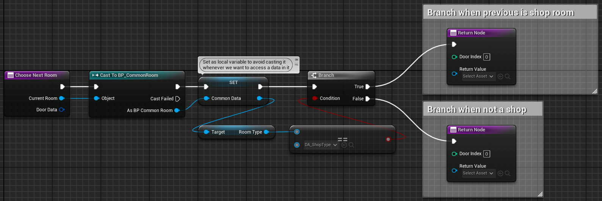
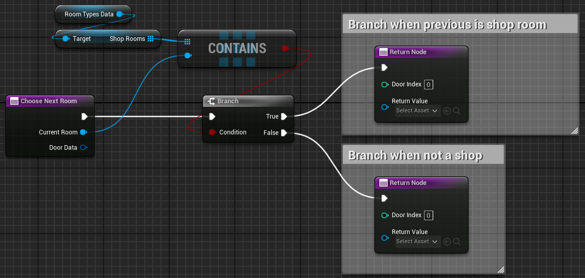

# Room Types

There is no built-in room type system provided by the plugin, because it mainly depends on the game you are creating.

However, you have several ways to implement it yourself.\
Here some of them:

- Hierarchy of `Room Data` child classes
- Variable in your base `Room Data` class
- Arrays of `Room Data`

---

## Child Room Data Classes

| Pros | Cons |
| --- | --- |
| You can define variables specific for those types. For example, your "Shop" rooms could have a variable to tell what type of item the shop sell (clothes, food, electronic, etc.). | If you want to change the type (class) of a room data asset, you must re-create it with the new class, copy/paste shared data from the old asset to the new asset, and don't forget to change the data reference in the room level. (You can keep the same room level, you just have to change the data asset reference in it). |

You can create different child blueprint classes of the `Room Data` class.

I would always recommend to create a common blueprint class deriving from the `Room Data` class of the plugin, so you can add whatever project-specific variables in it which are shared by all your rooms.

Then, you can create child classes of this common class for each type of room in your dungeon (for example "Shop" and "Corridor" for the dungeon example I've used [here](../Best-Practices/Workflows/Dungeon-Generation-Algorithm.md)).

If you want a hierarchical type system (meaning having "groups" of types, sub-types, etc.) you can create child classes of those types. For example, you could have "Large Corridor" and "Small Corridor" deriving from the "Corridor" type.

This is what the class diagram (the hierarchy of the classes) should looks like:

The dotted classes is to show the optional sub-types.
Here how it looks like in your editor (blue are the child classes, pink are the asset instances of these classes) :

If you want to check what type of room you have in your `Choose Next Room`, you must cast the room data into the class you want. You can then also access to the variables specific to this blueprint class if you want.

---

## Variable in your Base Room Data Class

| Pros | Cons |
| --- | --- |
| You can change room type of an asset without re-creating it and you can define new types of room easily. | You can't have variables specific to the room types as all the room data assets will share the same blueprint class. |

If you don't need specific variables in each of your room types, you can use a variable to differentiate your rooms by a "type".

You can use whatever variable type you want:

- An integer is sufficient (room type 0, room type 1, etc.) but not very practical.
- A `Name` can be used, but is error-prone because you must not make a typo when typing it in the data asset.
- An enum is the best choice for a simple type. It's an integer variable with labels, and you have a dropdown to select it so you can't misspelled the names. However, you can't have hierarchical room type. You can set multiple types per room by making the variable an array.

- A `Gameplay Tag` is like an enum, but also provides a hierarchical information. For example, you can create a tag `Room.Corridor.Large` and `Room.Corridor.Small` and you can test for any corridor type by testing the tag `Room.Corridor`. You can also use a `Gameplay Tag Container` variable to allow multiple types per room.

- A `Data Asset` is also usable, like the `Door Type` system of the plugin. You can create a child class of `Data Asset` (we can name it `Room Type`) then create different asset instances of the data asset class. Then you can reference these `Room Type` data assets in a variable in your `Room Data` assets. This solution allows you to add data to those room types (but shared by all rooms of same type).

---

## Arrays of `Room Data`

| Pros | Cons |
| --- | --- |
| You can switch the `Data Asset` storing arrays of type in your dungeon generator so your rooms can have different types depending on the context. | You have to maintain those arrays whenever you create or delete room data assets. |

This is maybe the less "clean" way of doing a room type, but can be useful in specific cases.

You can create a new `Data Asset` class that store arrays of `Room Data` for each type of room you want. For example, you can have an array `Corridor Rooms` containing all the corridor room data, an array `Shop Rooms` with all the shop room data, etc.

You can use the built-in `Room Data` class directly for you room data assets, without having to create at least a common child class (but I would still recommend to do it so you can add your game-specific data in your rooms).

It can be less performant than the other solutions when you have a lot of room data in your arrays, but this can be fixed easily by using sets instead of arrays. (sets are unordered as opposed to arrays, but are much faster to add/remove or check existence of an item in it with large amount of items).

