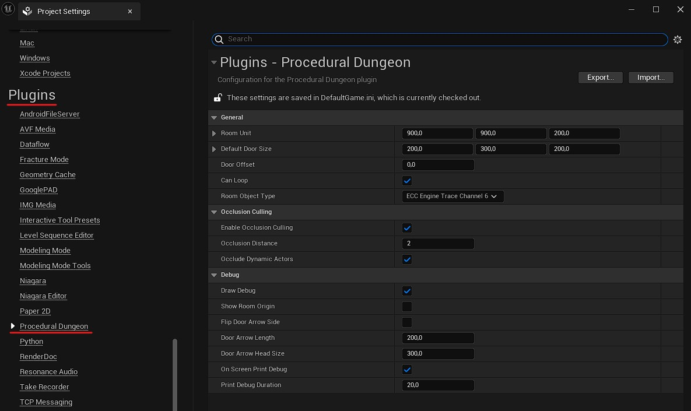

# Plugin Settings

The plugin adds several project-wide settings to allow you to customize it to your needs.

The settings are split in 2 places, one for the runtime module and one for the editor module.

## Runtime Settings
You can find the runtime settings in the `Project Settings` -> `Plugins` -> `Procedural Dungeon` (see screenshot below).

### General
Setting | Description
---|---
**Room&#160;Unit** | This is the size of a 1 unit room. Each room have a size made of a multiple of this unit. For instance, if you have a room unit of (1000, 1000, 400) and a room of size (3, 1, 2), this room will have in world unit a size of (3000, 1000, 800).
**Default&#160;Door&#160;Size** | This is the size used by the debug draw to draw the doors. This is just a visual indication for you, it is not used during the generation process.
**Door&#160;Offset** | You can add an offset on the Z-axis for the doors (eg. if you want to place a ground with a non-zero depth). This offset is a percentage between 0 and 1 of the room unit height.
**Can&#160;Loop** | Enable possibility to link doors when they can. [*DEPRECATED*] This setting is deprecated and will be removed in a future version. Use the `Can Loop` variable in the [Dungeon Generator](Dungeon-Generator.md) instead. As long as this setting remains, it will act as a global toggle for the feature. You should keep it ticked if you want to get the same behavior as when it will be removed.
**Room&#160;Object&#160;Type** | The Object Type used by the room trigger box to test actor overlaps. By default it is set to `ECC_EngineTraceChannel6`, you cannot set that channel from the editor but you can from the `DefaultGame.ini` file if you want to revert back to the default value. You can create new [Object Type Channels](https://docs.unrealengine.com/4.27/en-US/InteractiveExperiences/Physics/Collision/HowTo/AddCustomCollisionType/) from your project settings if you want a special channel for the dungeon rooms, and have controls on which actors can interact with them.

### Occlusion Culling
*Note: These settings are badly named and should be referred as `Room Culling` instead. It will be changed in a future version.*
Setting | Description
---|---
**Enable&#160;Occlusion&#160;Culling** | This enables the occlusion culling system (see [Occlusion Culling](Occlusion-Culling.md) for more details).
**Occlusion&#160;Distance** | Define the distance (in number of connected rooms) of visible rooms from the player's room.
**Occlude&#160;Dynamic&#160;Actors** | Set it if you want to have dynamic actors with a `RoomVisibility` component tracked in the rooms to show/hide them with the room occlusions (see [Occlusion Culling](Occlusion-Culling.md) for more details).

### Debug
Setting | Description
---|---
**Draw&#160;Debug** | This will display the debug draw of room bounding volume and doors volume in editor and development builds.
**Show&#160;Room&#160;Origin** | If ticked, shows the room's local origin (0,0,0) with a magenta octahedron. [*DEPRECATED*] This setting is deprecated and will be removed in a future version (unless someone considers that it's really useful).
**Flip&#160;Door&#160;Arrow&#160;Side** | If ticked, the door arrows will point to the inside of the room instead of the outside.
**Door&#160;Arrow&#160;Length** | The length of the door arrow.
**Door&#160;Arrow&#160;Head&#160;Size** | The size of the arrow head.
**On&#160;Screen&#160;Print&#160;Debug** | This will prints some debug messages on the player screen in addition to the logs (useful to compare seeds when testing multiplayer).
**Print&#160;Debug&#160;Duration** | The duration in seconds of the on screen debug messages.

## Editor Settings

You can find the editor related settings in the `Project Settings` -> `Editor` -> `Procedural Dungeon` (see screenshot below).

### General
Setting | Description
---|---
**Default&#160;Room&#160;Data** | The default selected `Room Data` class in the class picker when creating a new asset from content browser.
**Use&#160;Automatically&#160;Default&#160;Class If&#160;No&#160;Child** | If the `Room Data` class set in the `Default Room Data` setting above has no child classes, then the class picker will not be displayed and an asset is created using the `Default Room Data` class directly.

### Room Editor Mode
Setting | Description
---|---
**Default Margins** | This is the default margins values for the volume utility function when activating the Room Editor mode.
**Use&#160;the&#160;room&#160;bounds&#160;center as&#160;pivot&#160;for&#160;camera&#160;orbit** | When `Orbit Camera Around Selection` is ticked in your Editor Preferences and this setting is also ticked, then the pivot for orbit rotation of the camera in the Room Editor mode will use the room's bound center instead of the current selection.
