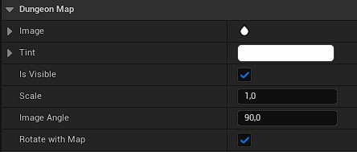

# Dungeon Map Component

## Overview

The [`Dungeon Map Component`](/docs/api/Classes/DungeonMapComponent/DungeonMapComponent.md) is an `Actor Component` you add to any actor you want to display as an **icon** on the [Dungeon Map widget](Dungeon-Map.md), such as the player, enemies, pickups or quest markers.

Every frame the map is updated (see the `Tick Frequency` of the [Dungeon Map widget](Dungeon-Map.md)), the component's actor location and rotation are read to position and orient its icon on the map.

## Parameters

- **`Image`**: the brush used to draw the entity's icon on the map. It defaults to a small built-in icon, but you should replace it with your own texture or material.
- **`Tint`**: the color used to tint the icon. Defaults to white (i.e. the icon's own colors, untouched). Can also be changed at runtime with `Set Tint`.
- **`Is Visible`**: whether the entity is currently displayed on the map. Can also be changed at runtime with `Set Visible`, for example to hide an entity until it has been discovered by the player.
- **`Scale`**: a uniform scale factor applied to the icon's size on the map.
- **`Image Angle`**: an angle offset (in degrees) added to the actor's yaw rotation before drawing the icon. Use this to compensate for the default orientation baked into your icon texture. For example, since the north is in positive X axis (right direction) in the texture, if your icon art points to the up or down of the texture, you would offset it by `90°` or `-90°`.
- **`Rotate With Map`**: if enabled, the icon's rotation also follows the map's own rotation (e.g. when the map [rotates with the player's camera](Dungeon-Map.md#rotation)), on top of the actor's own rotation. If disabled, the icon only follows the actor's rotation and ignores the map's rotation.
