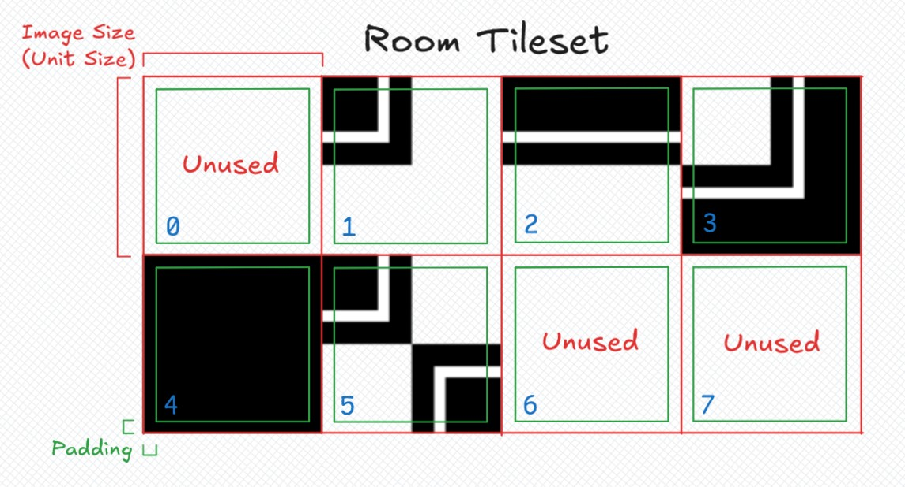
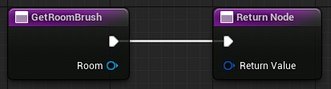
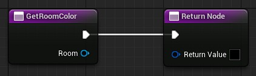
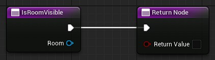
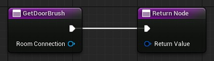
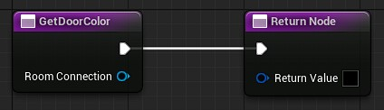
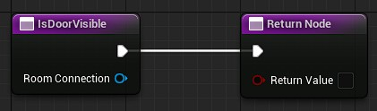
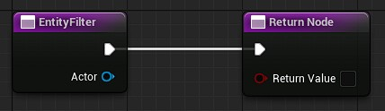

# Customizing your Map

The [Dungeon Map widget](Dungeon-Map.md) and the [Dungeon Map Component](Component.md) provide default properties (a default room/door brush, a default entity icon, etc.) which are useful for a ready-to-use widget.

## Creating your own Room Tileset

The brush used for the room is not simply stretched over each room cell. It is treated as a small tileset, sliced automatically into 5 tile variants using a **dual-grid** system.

The Dual-Grid system is a well-known technique in tile-based rendering, and a deeper explanation is out of the scope of this documentation. If you want to understand exactly how it works, you can check:

- A [short and cool video](https://www.youtube.com/watch?v=jEWFSv3ivTg) explaining why the Dual-Grid system is great.
- A [longer but still cool video](https://www.youtube.com/watch?v=aWcCNGen0cM) explaining how to use even less tiles with Dual-Grid system.
- The [Marching squares](https://en.wikipedia.org/wiki/Marching_squares) article on Wikipedia, which describes the underlying algorithm more technically.

Here an overview of the room tileset used by the `Dungeon Map` widget:

The tileset is a 4x2 grid, to keep a power-of-2 size for the entire tileset (if you use a power-of-2 for the size of one tile, too).
So there are some unused tiled (tiles 6 and 7).

The tiles 0 to 4 have been arranged this way to ease the tile selection when drawing the map (the tile index matches the number of quarters containing a room).  
Since the tile 0 has no room in it and draws nothing, it is just not used at all and the draw is completely skipped for that tile.  
The tile 5 is a special case of the tile 2 where the room quarters are diagonally arranged.

All the tiles are rotated (not flipped) when drawn to accommodate every duplicate cases.

The `Image Size` values in your brushes must be the size of **one tile** in the tileset. Not the total size of the tileset.  
The `Image Size` must match the `Unit Size` if you want to keep the same pixel size across multiple brushes (as well with the door brushes).  
The `Padding` is used to create a small gap between tiles to overcome the filters and imprecisions of texture sampling in Unreal Engine. Keeping 1 pixel of padding is enough in almost all cases. However, when your tileset is setup with bilinear or trilinear filters, and you see some artifacts on your map, then you may increase the padding to 2 pixels.
You can use a padding of 0 if you want the full tile to be displayed and you are not bothered by small artifacts on your map.

The effective tile drawn on the map is the green square, so you should keep that in mind when creating your tileset.

## Further Style Customization

The `Dungeon Map` widget also exposes several overridable functions, either in a Blueprint or a C++ child class, to fully customize how rooms, doors and entities are drawn individually.

All the overrides below belong to your `Dungeon Map` widget child class (Blueprint or C++).

### Per-Room Customization

#### Get Room Brush

Returns the brush used to draw a given room on the map. Called for every visible room, each time the map is rebuilt or ticks.

By default, it returns the `Default Room Brush` set in the widget's `Style`. Override it to return a different brush depending on the room, for example based on a [Room Custom Data](../../Advanced-Features/Room-Custom-Data.md) that defines the room's type (a boss room, a secret room, etc.).

:::info

The brush you return is not drawn as-is. See [how to create your own tileset](#creating-your-own-room-tileset) above to understand how it is used.

:::

#### Get Room Color

Returns the tint color applied to a room's brush. Called for every visible room, each time the map is rebuilt or ticks.

Defaults to white (i.e. no tint). Override it to color rooms depending on their state, for example to highlight the room the player is currently in, or to grey out rooms that haven't been explored yet.

#### Is Room Visible

Returns whether a room should be drawn on the map at all. Called for every room, each time the map is rebuilt or ticks.

Defaults to `true`. Override it to implement a fog-of-war-like behavior, for example by only revealing rooms the player has already visited.

### Per-Door Customization

#### Get Door Brush

Returns the brush used to draw a given door on the map. Called for every visible door, each time the map is rebuilt or ticks.

Defaults to the `Default Door Brush` set in the widget's `Style`. Override it to display a different brush depending on the [door type](../../Advanced-Features/Door-Types.md) or its lock state.

#### Get Door Color

Returns the tint color applied to a door's brush. Called for every visible door, each time the map is rebuilt or ticks.

Defaults to white (i.e. no tint).

#### Is Door Visible

Returns whether a door should be drawn on the map. Called for every door, each time the map is rebuilt or ticks.

Defaults to `true` if both rooms it connects are valid (doors leading outside of the dungeon are hidden by default). Override it if you also want to hide doors that haven't been discovered yet, for instance.

### Per-Entity Customization

The [`Dungeon Map Component`](Component.md) already handles per-entity customization. You may directly update its properties (`Image`, `Tint`, `Is Visible`, `Scale`, `Image Angle`, `Rotate With Map`) using the getters/setters, and the `Dungeon Map` will get the new values during its next tick.

You can create a Blueprint (or C++) child class of the component to add your own logic, for example updating its `Tint` or `Is Visible` at runtime depending on gameplay state (low health, quest state, stealth detection, etc.).

The `Dungeon Map` widget has also an override if you want to control the entity visibilities at the map level (see below).

#### Entity Filter

Returns whether an entity (an actor with a [Dungeon Map Component](Component.md)) should currently be displayed on the map. Called for every registered entity, each time the map ticks.

Defaults to `true`. This is combined with the entity's own `Is Visible` property (both must be true for the entity to be drawn), so this is a good place to implement a global visibility rule for all entities at once, for example only showing enemies that are within a certain range of the player.
