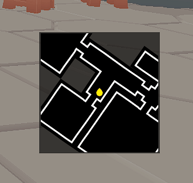
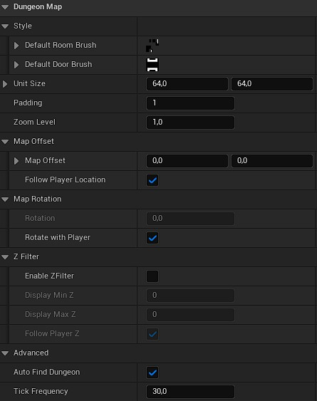

# Dungeon Map Widget

## Overview

The [`Dungeon Map`](/docs/api/Classes/DungeonMap/DungeonMap.md) widget is an easy-to-use and yet powerful UMG widget to display a map of your dungeon in your UI.  
Performance-wise, the widget is using low-level Slate drawing methods to reduce as much possible the overhead coming with Slate/UMG elements.

The widget is configurable to use it either as a full map or as a minimap in your HUD.

## Parameters

#### Appearance

- **`Style`**: You can set up the default room brush and door brush used by the map. Check [how to customize](Customizing.md) your widget to setup specific brushes per room/door.
- **`Unit Size`**: This one is tricky. It should match the `Image Size` of your room brush. The `Image Size` of your brush must be the size of **one tile** on the tileset.
- **`Padding`**: This is a padding (in pixels) used for the tileset of the Room Brush. Must be used only in specific cases. Keep `1` unless you see artifacts on your map (in that case set it to 2). See [how the room tileset works](Customizing.md#dual-grid-tileset) for a better understanding of this parameter.

#### Zooming

- **`Zoom Level`**: Use this variable to control the zoom on the map. `1` means no zoom, increase it to zoom in, and decrease it to zoom out.

#### Rotation

- **`Rotation`**: The rotation angle in degrees of the map.
- **`Rotate with Player`**: If enabled, the map will rotate using the player's camera rotation.

#### Z Filtering

- **`Enable ZFilter`**: Toggle the Z filtering for rooms and entities on the map. When enabled, only rooms and entities contained between `Display Min Z` and `Display Max Z` will be displayed on the map.
- **`Display Min Z`**: The minimum Z level in Room Units to display on the map. If `Follow Player Z` is enabled, relative to the player Z level.
- **`Display Max Z`**: The maximum Z level in Room Units to display on the map. If `Follow Player Z` is enabled, relative to the player Z level.
- **`Follow Player Z`**: If enabled, the `Display Min Z` and `Display Max Z` are relative to the player's Z location.

#### Offset

- **`Follow Player Location`**: If enabled, the map will keep the player at the center of the map.
- **`Map Offset`**: Adds an offset to the center of the map. If `Follow Player Location` is enabled, this is relative to the player's location.

#### Others

- **`Auto Find Dungeon`**: If enabled, will get the first `Dungeon Generator` found in the level to draw its map. If disabled, you will have to use `Set Dungeon` on the dungeon generator you want to display.
- **`Tick Frequency`**: How many times the map data are updated per second. This includes the entities location/rotation, colors and brushes, as well for the rooms and doors.

## How to use it

### Adding it to your UI

The `Dungeon Map` is a regular `UWidget`, so you can add it in any `Widget Blueprint` like you would with any other UMG widget.
In the widget designer's palette panel, it can be found under the `Procedural Dungeon` category.

Because it draws everything itself using Slate, you don't need to bind or fill any `Image` widget: just drop it in your layout, resize it, and it will start displaying the dungeon on its own.

### Full map or Minimap

The same widget can be used for both of the use cases shown in the gifs above, only the properties change:

- For a **full map**, typically shown when the player opens a menu, prefer a lower `Zoom Level` (to see more of the dungeon at once), keep `Rotation` fixed (e.g. `0`, north-up) rather than `Rotate with Player`, and disable `Follow Player Location` if you want the player to be able to pan/frame the whole dungeon rather than always being recentered.
- For a **minimap**, always visible in a corner of the HUD, prefer a higher `Zoom Level` (to only show the area around the player) and enable `Follow Player Location` and `Rotate with Player` so it always represents what's immediately around the player.

:::tip

You can place multiple `Dungeon Map` widgets in your UI at the same time (e.g. an always-visible minimap plus a togglable full map), each with its own set of properties.

:::

### Assigning a dungeon

By default (`Auto Find Dungeon` enabled), the widget looks for the first `Dungeon Generator` actor in the level and displays it automatically, which is enough for most projects with a single dungeon.

If you have several `Dungeon Generator` actors (for example several dungeons loaded in different sub-levels, or several dungeon instances in a multiplayer lobby), disable `Auto Find Dungeon` and call `Set Dungeon` yourself with a reference to the generator you want this widget to display. You can call `Set Dungeon` again at any time (e.g. when the player switches floor or instance) to make the widget display a different dungeon.

Whichever way the dungeon is assigned, the widget automatically rebuilds its map whenever that dungeon finishes generating, so you don't need to call anything after `Set Dungeon`. The `Rebuild Map` function is exposed to Blueprint if you ever need to force a refresh manually, for example after modifying the dungeon's rooms outside of the normal generation flow.
