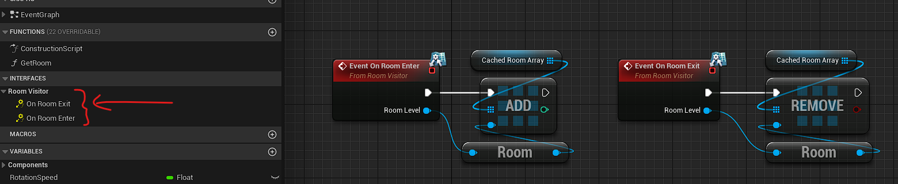

The `Room Visitor` interface is useful to add behaviors to your actors or components when they enters or exit a room.

You can use this interface to keep track of the rooms the actor is in to be able to call functions on them, change some [[Room Custom Data|Room Custom Data]] variables, display various details on player's HUD, etc.

For example, the [[Room Visibility Component|Occlusion Culling]] (used to show/hide an actor with the rooms it is in) is implementing the `Room Visitor` interface to bind/unbind to the room's visibility event dispatcher when the actor enters or exits any room, and thus can change its visibility according to the room visibility state.

# How to use it

Just add the interface like any other interface in Blueprint or C++, and implement its functions.

For example, this is a simple implementation in Blueprint to keep a reference of the rooms an actor is in (stored in an array called `Cached Room Array`).

